# App Flow Document
## AI-Powered Financial Document Similarity Finder 📄🔍

This document maps every major user journey through the **AI-Powered Financial Document Similarity Finder** product.

The product is a local AI-powered finance document similarity system where users upload invoices, receipts, purchase orders, statements, and payment records, then search for semantically similar documents using **React + Spring Boot + Python embeddings + Qdrant + PostgreSQL + OCR**.

The app includes authentication, onboarding, document upload/search APIs, vector search, metadata storage, audit logs, user management, workflow status, and admin/security operations.

---

# 1. Product Overview

## 1.1 Primary Users

| User Type | Purpose |
|---|---|
| Finance Staff | Upload documents, search similar documents, detect duplicates |
| Finance Manager | Review duplicate/fraud alerts, approve/reject documents |
| Admin | Manage users, roles, permissions, retention, audit logs |
| System/Internal Services | Parse files, run OCR, generate embeddings, store/search vectors |

---

## 1.2 Core Product Capabilities

The product supports:

1. User authentication
2. First-time onboarding
3. Document upload
4. Text extraction from PDF/DOCX/TXT
5. OCR for scanned documents
6. Text chunking
7. Embedding generation
8. Qdrant vector storage
9. Similarity search
10. Duplicate invoice detection
11. Fraud/anomaly flagging
12. Metadata filtering
13. Audit logging
14. Admin user and role management

---

# 2. Authentication Flow

## 2.1 Sign Up Flow

### Numbered Flow

1. **User opens Sign Up screen** → System checks whether public registration is enabled → Screen shows registration form.
2. **User enters name, email, password, confirm password** → System validates required fields → Screen shows inline validation if fields are missing.
3. **User clicks “Create Account”** → Frontend sends request to backend → System checks whether email already exists.
4. **IF email already exists** → System rejects request → Screen shows “Account already exists. Please login.”
5. **ELSE email is new** → System creates user with default role, usually `Finance Staff`.
6. **System sends email verification link** → Screen shows “Check your email to verify account.”
7. **User verifies email** → System activates account → Screen redirects to Login.
8. **User logs in successfully** → System generates access token and refresh token → Screen redirects to onboarding or dashboard.

### Mermaid Diagram

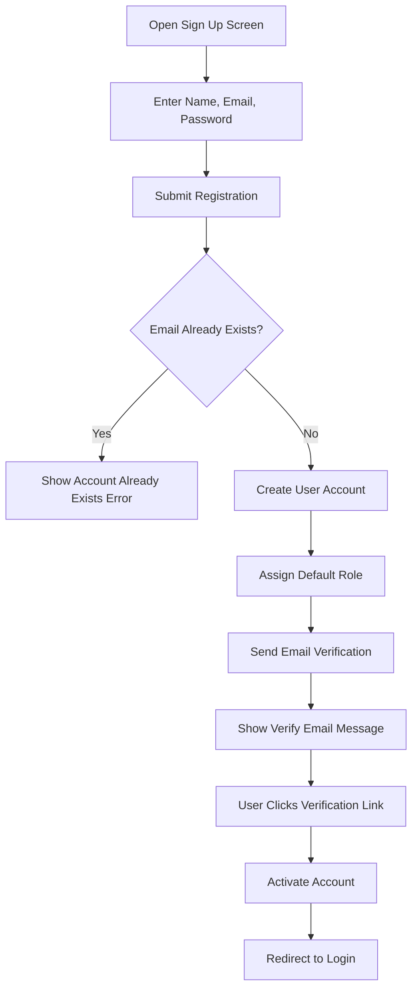
```mermaid
flowchart TD
    A[Open Sign Up Screen] --> B[Enter Name, Email, Password]
    B --> C[Submit Registration]
    C --> D{Email Already Exists?}
    D -- Yes --> E[Show Account Already Exists Error]
    D -- No --> F[Create User Account]
    F --> G[Assign Default Role]
    G --> H[Send Email Verification]
    H --> I[Show Verify Email Message]
    I --> J[User Clicks Verification Link]
    J --> K[Activate Account]
    K --> L[Redirect to Login]
```

---

## 2.2 Login Flow

### Numbered Flow

1. **User opens Login screen** → System checks if user already has a valid token → Screen either redirects to dashboard or shows login form.
2. **User enters email and password** → System validates input format → Screen shows errors if invalid.
3. **User clicks Login** → Backend verifies credentials.
4. **IF credentials are invalid** → System returns authentication error → Screen shows “Invalid email or password.”
5. **IF email is not verified** → System blocks login → Screen shows “Please verify your email.”
6. **IF credentials are valid** → System generates access token and refresh token.
7. **System stores token securely** → Screen redirects to dashboard.
8. **System loads user role and permissions** → UI shows allowed menu items only.

### Mermaid Diagram

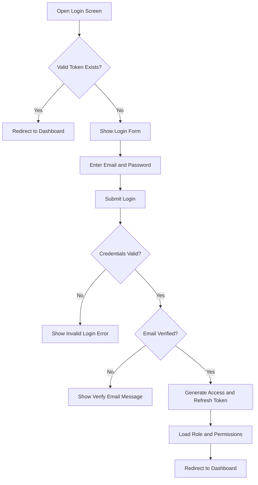
```mermaid
flowchart TD
    A[Open Login Screen] --> B{Valid Token Exists?}
    B -- Yes --> C[Redirect to Dashboard]
    B -- No --> D[Show Login Form]
    D --> E[Enter Email and Password]
    E --> F[Submit Login]
    F --> G{Credentials Valid?}
    G -- No --> H[Show Invalid Login Error]
    G -- Yes --> I{Email Verified?}
    I -- No --> J[Show Verify Email Message]
    I -- Yes --> K[Generate Access and Refresh Token]
    K --> L[Load Role and Permissions]
    L --> M[Redirect to Dashboard]
```

---

## 2.3 Password Reset Flow

### Numbered Flow

1. **User clicks “Forgot Password”** → System opens password reset screen → Screen asks for email.
2. **User enters email** → System validates email format.
3. **User submits request** → Backend checks whether account exists.
4. **IF account does not exist** → System still shows generic success message for security.
5. **IF account exists** → System sends password reset link.
6. **User clicks reset link** → System validates reset token.
7. **IF token expired or invalid** → Screen shows “Reset link expired. Request a new one.”
8. **ELSE token valid** → Screen shows new password form.
9. **User submits new password** → System validates password strength.
10. **System updates password** → Existing sessions are invalidated.
11. **Screen redirects to Login** → User logs in again.

### Mermaid Diagram

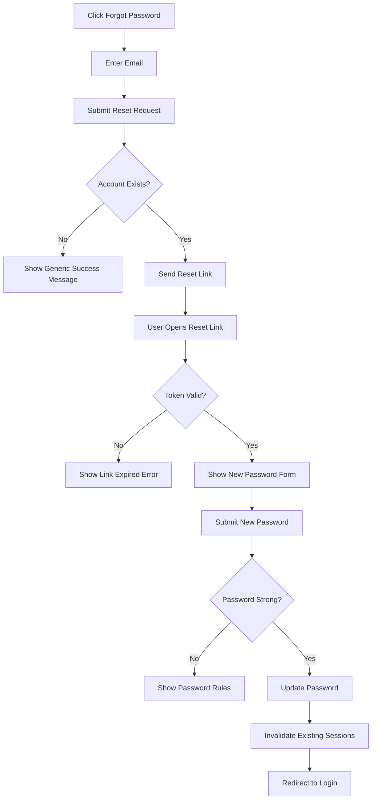
```mermaid
flowchart TD
    A[Click Forgot Password] --> B[Enter Email]
    B --> C[Submit Reset Request]
    C --> D{Account Exists?}
    D -- No --> E[Show Generic Success Message]
    D -- Yes --> F[Send Reset Link]
    F --> G[User Opens Reset Link]
    G --> H{Token Valid?}
    H -- No --> I[Show Link Expired Error]
    H -- Yes --> J[Show New Password Form]
    J --> K[Submit New Password]
    K --> L{Password Strong?}
    L -- No --> M[Show Password Rules]
    L -- Yes --> N[Update Password]
    N --> O[Invalidate Existing Sessions]
    O --> P[Redirect to Login]
```

---

## 2.4 Token Refresh Flow

### Numbered Flow

1. **User performs any authenticated action** → Frontend sends access token with API request.
2. **Backend validates access token**.
3. **IF access token is valid** → System processes request normally.
4. **IF access token expired** → Frontend sends refresh token to refresh endpoint.
5. **Backend validates refresh token**.
6. **IF refresh token is valid** → System issues new access token → Original API request is retried.
7. **IF refresh token is invalid or expired** → System logs user out → Screen redirects to Login with message “Session expired.”

### Mermaid Diagram

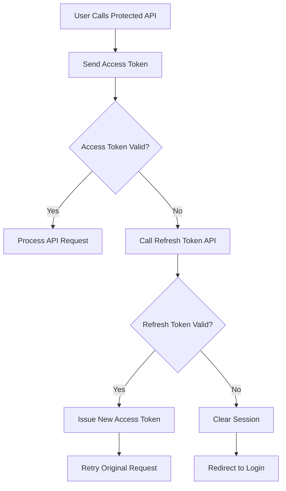
```mermaid
flowchart TD
    A[User Calls Protected API] --> B[Send Access Token]
    B --> C{Access Token Valid?}
    C -- Yes --> D[Process API Request]
    C -- No --> E[Call Refresh Token API]
    E --> F{Refresh Token Valid?}
    F -- Yes --> G[Issue New Access Token]
    G --> H[Retry Original Request]
    F -- No --> I[Clear Session]
    I --> J[Redirect to Login]
```

---

# 3. Onboarding Flow

## 3.1 First-Time User Experience

### Goal

Help a new finance user understand the app and prepare the system for document upload, search, and duplicate detection.

### Numbered Flow

1. **User logs in for first time** → System checks `onboarding_completed=false` → Screen redirects to onboarding welcome.
2. **Screen shows product intro** → User clicks “Get Started.”
3. **User selects role context** → Example: Finance Staff, Manager, Admin.
4. **System displays allowed actions based on role** → Screen shows role-specific onboarding checklist.
5. **User configures document categories** → Examples: Invoice, Receipt, PO, Bank Statement, Payment Record.
6. **User configures default search settings** → Top-K results, similarity threshold, metadata filters.
7. **User optionally uploads sample document** → System runs test extraction and similarity flow.
8. **IF sample upload succeeds** → Screen shows extracted text, metadata, and test result.
9. **IF sample upload fails** → Screen shows troubleshooting tips.
10. **User completes onboarding** → System sets `onboarding_completed=true`.
11. **Screen redirects to Dashboard** → User sees upload/search cards and recent activity.

### Mermaid Diagram

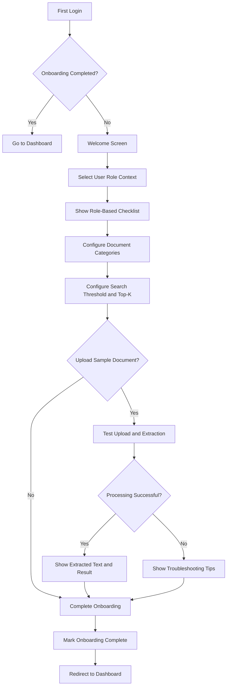
```mermaid
flowchart TD
    A[First Login] --> B{Onboarding Completed?}
    B -- Yes --> C[Go to Dashboard]
    B -- No --> D[Welcome Screen]
    D --> E[Select User Role Context]
    E --> F[Show Role-Based Checklist]
    F --> G[Configure Document Categories]
    G --> H[Configure Search Threshold and Top-K]
    H --> I{Upload Sample Document?}
    I -- No --> J[Complete Onboarding]
    I -- Yes --> K[Test Upload and Extraction]
    K --> L{Processing Successful?}
    L -- Yes --> M[Show Extracted Text and Result]
    L -- No --> N[Show Troubleshooting Tips]
    M --> J
    N --> J
    J --> O[Mark Onboarding Complete]
    O --> P[Redirect to Dashboard]
```

---

# 4. Core Feature Flows

---

# 4.1 Dashboard Flow

## Entry Point

User logs in or clicks Dashboard from navigation.

### Numbered Flow

1. **User opens Dashboard** → System checks authentication and role → Screen loads dashboard widgets.
2. **System fetches recent documents** → Screen shows latest uploads.
3. **System fetches alerts** → Screen shows duplicate/fraud alerts.
4. **System fetches search history** → Screen shows recent searches.
5. **User clicks Upload Document** → System redirects to Upload screen.
6. **User clicks Search Similar** → System redirects to Search screen.
7. **User clicks Alert** → System redirects to Alert Detail screen.
8. **User clicks Document** → System redirects to Document Detail screen.

### Mermaid Diagram

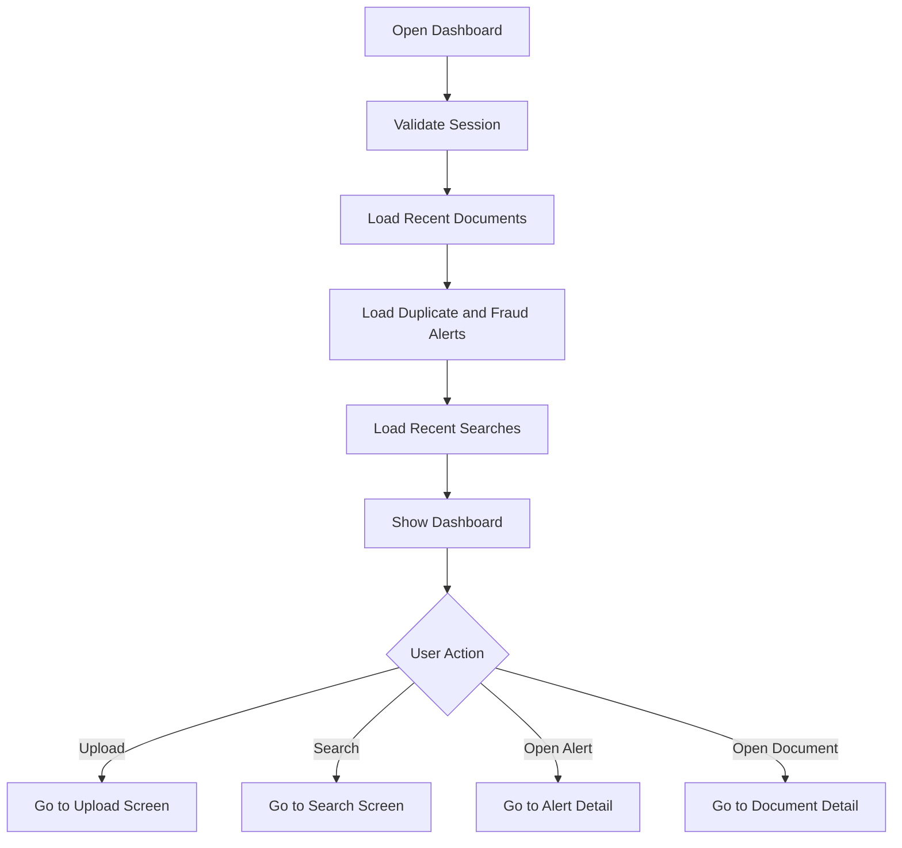
```mermaid
flowchart TD
    A[Open Dashboard] --> B[Validate Session]
    B --> C[Load Recent Documents]
    C --> D[Load Duplicate and Fraud Alerts]
    D --> E[Load Recent Searches]
    E --> F[Show Dashboard]
    F --> G{User Action}
    G -- Upload --> H[Go to Upload Screen]
    G -- Search --> I[Go to Search Screen]
    G -- Open Alert --> J[Go to Alert Detail]
    G -- Open Document --> K[Go to Document Detail]
```

---

# 4.2 Document Upload Flow

This is one of the main flows. The upload pipeline sends the file to Spring Boot, extracts text, uses OCR if required, chunks text, generates embeddings, and stores vectors with metadata in Qdrant.

## Entry Point

Dashboard → Upload Document  
or Navigation → Documents → Upload

### Numbered Flow

1. **User opens Upload Document screen** → System checks upload permission → Screen shows file upload area.
2. **User selects file** → Frontend validates file type and size.
3. **IF file type is unsupported** → Screen shows “Only PDF, DOCX, TXT, and image files are supported.”
4. **ELSE file is valid** → Screen shows selected file name and Upload button.
5. **User clicks Upload** → Frontend sends file to `POST /api/documents/upload`.
6. **Backend stores temporary file** → System starts document processing.
7. **System detects file type** → Parser selects PDF, DOCX, TXT, or OCR path.
8. **IF digital text exists** → System extracts text using parser.
9. **ELSE scanned document** → System sends file to OCR.
10. **System cleans extracted text** → Removes noise and normalizes whitespace.
11. **System extracts metadata** → Invoice number, vendor, date, amount, currency, document type.
12. **System chunks text** → Creates smaller text segments for embedding.
13. **System sends chunks to Python embedding service** → Embedding service returns vectors.
14. **System stores vector + metadata in Qdrant** → PostgreSQL stores document metadata and audit log.
15. **IF storage succeeds** → Screen shows “Upload complete.”
16. **IF storage fails** → Screen shows “Upload failed. Try again.”
17. **User can click View Document** → Screen opens Document Detail.
18. **User can click Find Similar** → Screen opens Similarity Search with uploaded document preselected.

### Decision Points

| Condition | System Response |
|---|---|
| Unsupported file | Reject before upload |
| File too large | Show size limit error |
| Text extraction empty | Run OCR |
| OCR fails | Mark document as processing failed |
| Qdrant unavailable | Save document as pending vector indexing |
| Duplicate invoice number found | Show duplicate warning |

### Mermaid Diagram

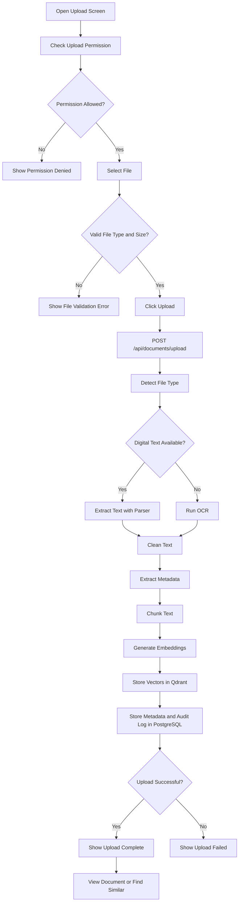
```mermaid
flowchart TD
    A[Open Upload Screen] --> B[Check Upload Permission]
    B --> C{Permission Allowed?}
    C -- No --> D[Show Permission Denied]
    C -- Yes --> E[Select File]
    E --> F{Valid File Type and Size?}
    F -- No --> G[Show File Validation Error]
    F -- Yes --> H[Click Upload]
    H --> I[POST /api/documents/upload]
    I --> J[Detect File Type]
    J --> K{Digital Text Available?}
    K -- Yes --> L[Extract Text with Parser]
    K -- No --> M[Run OCR]
    L --> N[Clean Text]
    M --> N
    N --> O[Extract Metadata]
    O --> P[Chunk Text]
    P --> Q[Generate Embeddings]
    Q --> R[Store Vectors in Qdrant]
    R --> S[Store Metadata and Audit Log in PostgreSQL]
    S --> T{Upload Successful?}
    T -- Yes --> U[Show Upload Complete]
    T -- No --> V[Show Upload Failed]
    U --> W[View Document or Find Similar]
```

---

# 4.3 Similarity Search Flow

The search flow extracts text from a query document, chunks it, generates embeddings, queries Qdrant, merges duplicate results, applies thresholds, and returns similar documents.

## Entry Point

Dashboard → Search Similar  
Document Detail → Find Similar  
Upload Success → Find Similar

### Numbered Flow

1. **User opens Search Similar screen** → System checks search permission → Screen shows file upload/search form.
2. **User chooses search mode**:
   - Upload new query document
   - Select existing document
   - Search by text or metadata
3. **IF user uploads query document** → System validates file → Sends to backend.
4. **IF user selects existing document** → System fetches stored document vectors.
5. **System extracts or retrieves text** → Text is normalized.
6. **System chunks query text** → Each chunk is prepared for embedding.
7. **System generates query embeddings** → Embedding service returns vectors.
8. **System searches Qdrant** → Finds nearest vectors.
9. **System merges results by document ID** → Removes duplicate chunk-level matches.
10. **System applies similarity threshold**:
    - `> 0.85` strong match
    - `0.70–0.85` related match
    - `< 0.70` weak match
11. **System applies filters** → Vendor, date, amount, currency, department, document type.
12. **Screen shows result list** → Filename, vendor, invoice number, score, match category.
13. **User clicks result** → Screen opens Document Comparison.
14. **User exports results** → System generates CSV/PDF export if permitted.

### Decision Points

| Condition | System Response |
|---|---|
| No document selected | Show “Please select a document” |
| No similar result found | Show empty result state |
| Qdrant down | Show search temporarily unavailable |
| Score below threshold | Hide or show under weak matches |
| User lacks access to matched document | Mask restricted result |

### Mermaid Diagram

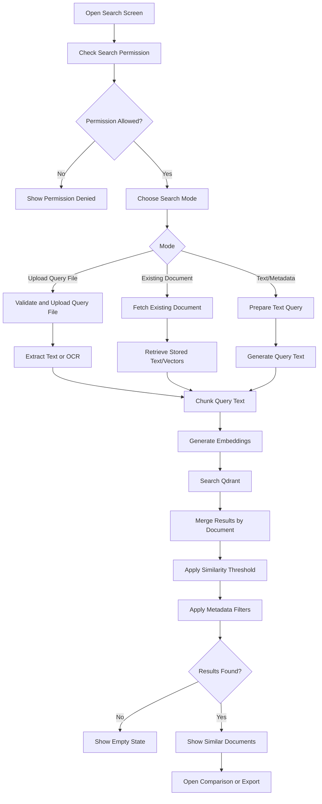
```mermaid
flowchart TD
    A[Open Search Screen] --> B[Check Search Permission]
    B --> C{Permission Allowed?}
    C -- No --> D[Show Permission Denied]
    C -- Yes --> E[Choose Search Mode]
    E --> F{Mode}
    F -- Upload Query File --> G[Validate and Upload Query File]
    F -- Existing Document --> H[Fetch Existing Document]
    F -- Text/Metadata --> I[Prepare Text Query]
    G --> J[Extract Text or OCR]
    H --> K[Retrieve Stored Text/Vectors]
    I --> L[Generate Query Text]
    J --> M[Chunk Query Text]
    K --> M
    L --> M
    M --> N[Generate Embeddings]
    N --> O[Search Qdrant]
    O --> P[Merge Results by Document]
    P --> Q[Apply Similarity Threshold]
    Q --> R[Apply Metadata Filters]
    R --> S{Results Found?}
    S -- No --> T[Show Empty State]
    S -- Yes --> U[Show Similar Documents]
    U --> V[Open Comparison or Export]
```

---

# 4.4 Document Detail Flow

## Entry Point

Dashboard → Recent Document  
Documents List → Open Document  
Search Results → Open Matched Document

### Numbered Flow

1. **User opens Document Detail screen** → System checks document access permission.
2. **IF user does not have access** → Screen shows permission denied.
3. **ELSE system fetches document metadata** → Screen shows file name, vendor, invoice number, amount, date, document type.
4. **System fetches extracted text preview** → Screen shows parsed/OCR text.
5. **System fetches similarity history** → Screen shows related documents.
6. **System fetches audit trail** → Screen shows upload/search/view activity if user has permission.
7. **User clicks Find Similar** → System starts similarity search using this document.
8. **User clicks Compare** → System opens comparison screen.
9. **User clicks Download** → System checks download permission.
10. **IF allowed** → File downloads.
11. **ELSE** → Screen shows restricted action message.

### Mermaid Diagram

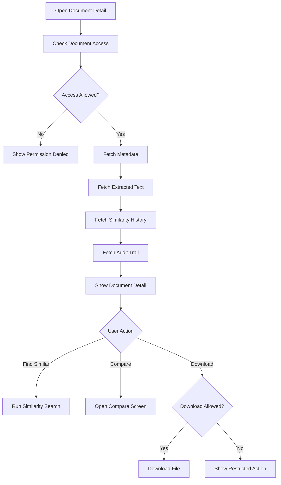
```mermaid
flowchart TD
    A[Open Document Detail] --> B[Check Document Access]
    B --> C{Access Allowed?}
    C -- No --> D[Show Permission Denied]
    C -- Yes --> E[Fetch Metadata]
    E --> F[Fetch Extracted Text]
    F --> G[Fetch Similarity History]
    G --> H[Fetch Audit Trail]
    H --> I[Show Document Detail]
    I --> J{User Action}
    J -- Find Similar --> K[Run Similarity Search]
    J -- Compare --> L[Open Compare Screen]
    J -- Download --> M{Download Allowed?}
    M -- Yes --> N[Download File]
    M -- No --> O[Show Restricted Action]
```

---

# 4.5 Document Comparison Flow

## Entry Point

Search Results → Compare  
Document Detail → Compare with selected document

### Numbered Flow

1. **User clicks Compare on a search result** → System opens comparison screen.
2. **System loads source document** → Screen shows metadata and extracted text.
3. **System loads matched document** → Screen shows metadata and extracted text.
4. **System calculates similarity explanation** → Shows matching chunks, score, metadata match.
5. **System checks duplicate rules**:
   - Same invoice number
   - Same vendor
   - Similar amount
   - High vector score
6. **IF strong duplicate detected** → Screen shows “Possible duplicate invoice.”
7. **IF related but not duplicate** → Screen shows “Related document.”
8. **User can mark as duplicate, ignore, or send for review**.
9. **System stores user decision** → Audit log is created.
10. **Screen updates alert/document status**.

### Mermaid Diagram

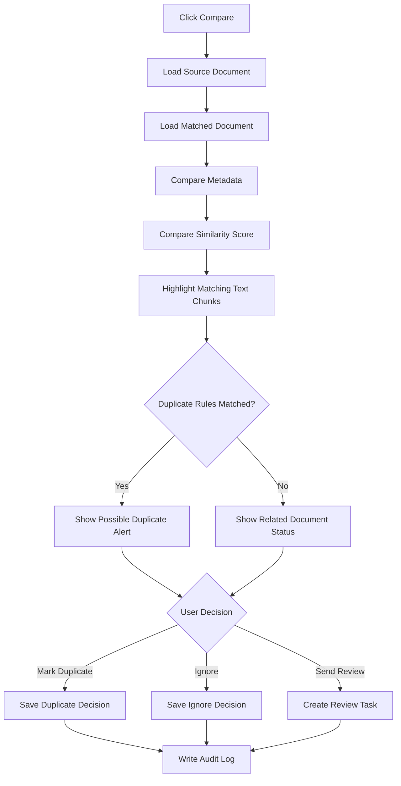
```mermaid
flowchart TD
    A[Click Compare] --> B[Load Source Document]
    B --> C[Load Matched Document]
    C --> D[Compare Metadata]
    D --> E[Compare Similarity Score]
    E --> F[Highlight Matching Text Chunks]
    F --> G{Duplicate Rules Matched?}
    G -- Yes --> H[Show Possible Duplicate Alert]
    G -- No --> I[Show Related Document Status]
    H --> J{User Decision}
    I --> J
    J -- Mark Duplicate --> K[Save Duplicate Decision]
    J -- Ignore --> L[Save Ignore Decision]
    J -- Send Review --> M[Create Review Task]
    K --> N[Write Audit Log]
    L --> N
    M --> N
```

---

# 4.6 Duplicate Invoice Detection Flow

Duplicate invoice detection uses similarity score and metadata such as vendor, invoice number, amount, date, and document type.

## Entry Point

Upload Flow  
Similarity Search Flow  
Scheduled Background Scan

### Numbered Flow

1. **System receives new uploaded document** → Metadata extraction starts.
2. **System extracts invoice number, vendor, amount, date**.
3. **System searches existing documents by invoice number and vendor**.
4. **IF exact invoice number match exists** → System marks as high-risk duplicate.
5. **ELSE system runs vector similarity search**.
6. **System checks score and metadata similarity**.
7. **IF similarity score > 0.85 and vendor/amount match** → System creates duplicate alert.
8. **IF similarity score is medium but metadata differs** → System creates review-needed alert.
9. **IF no match found** → System marks document as unique.
10. **Screen shows duplicate warning on upload result or alert dashboard**.
11. **Finance Manager reviews alert** → Manager marks duplicate, false positive, or needs investigation.
12. **System saves decision and audit log**.

### Mermaid Diagram

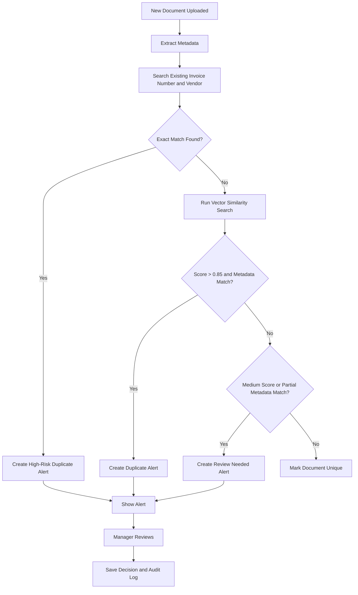
```mermaid
flowchart TD
    A[New Document Uploaded] --> B[Extract Metadata]
    B --> C[Search Existing Invoice Number and Vendor]
    C --> D{Exact Match Found?}
    D -- Yes --> E[Create High-Risk Duplicate Alert]
    D -- No --> F[Run Vector Similarity Search]
    F --> G{Score > 0.85 and Metadata Match?}
    G -- Yes --> H[Create Duplicate Alert]
    G -- No --> I{Medium Score or Partial Metadata Match?}
    I -- Yes --> J[Create Review Needed Alert]
    I -- No --> K[Mark Document Unique]
    E --> L[Show Alert]
    H --> L
    J --> L
    L --> M[Manager Reviews]
    M --> N[Save Decision and Audit Log]
```

---

# 4.7 Fraud / Anomaly Flagging Flow

## Entry Point

Document Upload  
Scheduled Analysis  
Admin-triggered Scan

### Numbered Flow

1. **System processes uploaded document** → Extracts metadata and embeddings.
2. **System compares document against vendor history**.
3. **System checks fraud rules**:
   - Same invoice number with different amount
   - Similar document with changed bank details
   - Amount much higher than vendor average
   - Unknown vendor
   - Unusual document format
4. **IF no suspicious pattern** → System marks as normal.
5. **IF suspicious pattern exists** → System creates fraud/anomaly alert.
6. **Screen shows alert with reason codes**.
7. **Manager opens alert** → System shows evidence and matched documents.
8. **Manager chooses action**:
   - Mark safe
   - Flag fraud
   - Request review
9. **System updates alert status** → Audit log is created.

### Mermaid Diagram

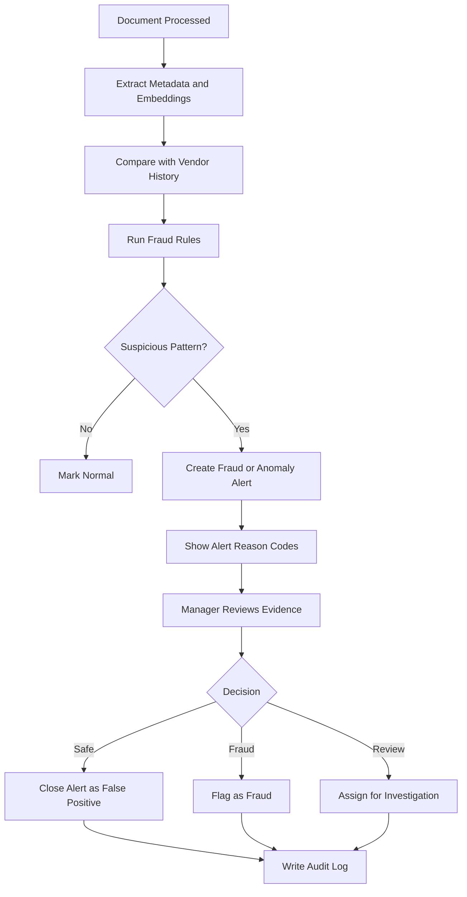
```mermaid
flowchart TD
    A[Document Processed] --> B[Extract Metadata and Embeddings]
    B --> C[Compare with Vendor History]
    C --> D[Run Fraud Rules]
    D --> E{Suspicious Pattern?}
    E -- No --> F[Mark Normal]
    E -- Yes --> G[Create Fraud or Anomaly Alert]
    G --> H[Show Alert Reason Codes]
    H --> I[Manager Reviews Evidence]
    I --> J{Decision}
    J -- Safe --> K[Close Alert as False Positive]
    J -- Fraud --> L[Flag as Fraud]
    J -- Review --> M[Assign for Investigation]
    K --> N[Write Audit Log]
    L --> N
    M --> N
```

---

# 4.8 Metadata Filtering Flow

## Entry Point

Search Similar screen  
Documents List screen  
Dashboard filter panel

### Numbered Flow

1. **User opens filter panel** → Screen shows available filters.
2. **User selects vendor, date range, amount range, currency, document type**.
3. **User applies filters** → Frontend sends filter parameters to backend.
4. **Backend validates filters**.
5. **IF invalid range** → Screen shows validation message.
6. **ELSE backend applies filters to PostgreSQL/Qdrant payload**.
7. **System returns filtered results**.
8. **Screen shows updated list**.
9. **IF no results found** → Screen shows empty state with option to clear filters.

### Mermaid Diagram

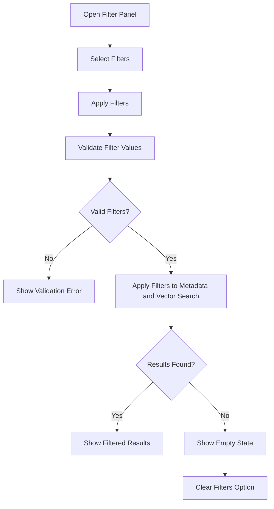
```mermaid
flowchart TD
    A[Open Filter Panel] --> B[Select Filters]
    B --> C[Apply Filters]
    C --> D[Validate Filter Values]
    D --> E{Valid Filters?}
    E -- No --> F[Show Validation Error]
    E -- Yes --> G[Apply Filters to Metadata and Vector Search]
    G --> H{Results Found?}
    H -- Yes --> I[Show Filtered Results]
    H -- No --> J[Show Empty State]
    J --> K[Clear Filters Option]
```

---

# 4.9 Approval Workflow Flow

## Entry Point

Duplicate Alert  
Fraud Alert  
Document Detail  
Approval Queue

### Numbered Flow

1. **System creates review item** → Document enters approval queue.
2. **Manager opens Approval Queue** → System loads pending review documents.
3. **Manager opens document** → System shows metadata, extracted text, similarity evidence, alerts.
4. **Manager chooses action**:
   - Approve
   - Reject
   - Hold
   - Request more review
5. **IF approved** → System updates document status to Approved.
6. **IF rejected** → System updates status to Rejected and requires reason.
7. **IF held** → System updates status to On Hold.
8. **IF more review requested** → System assigns to another user/team.
9. **System writes audit log** → Screen returns to Approval Queue.

### Mermaid Diagram

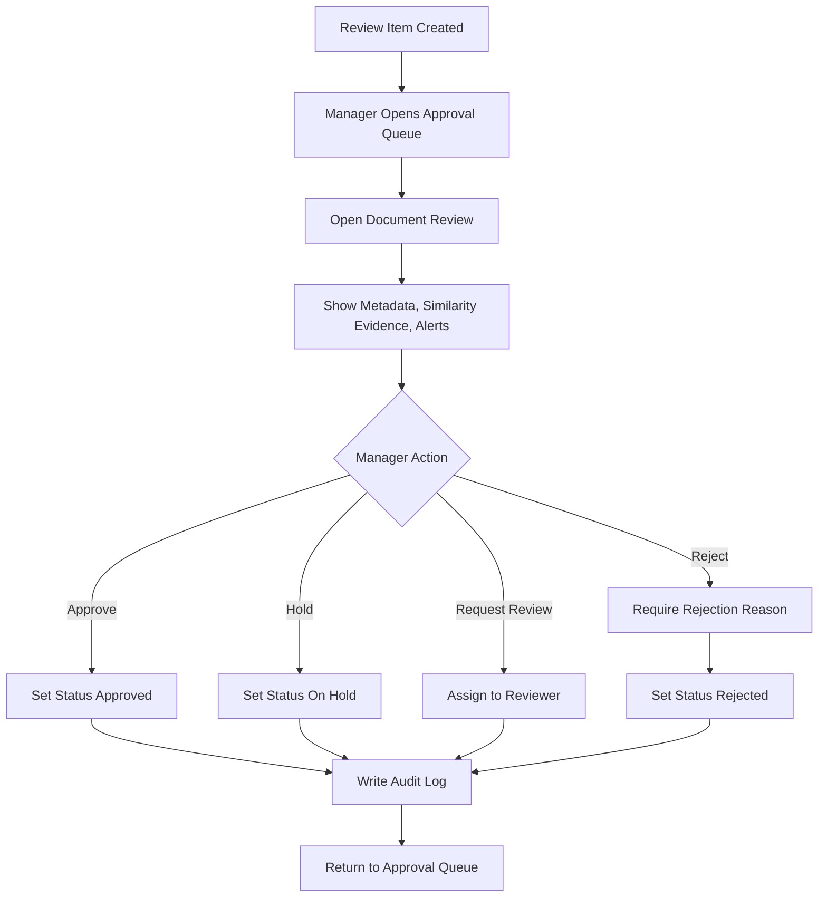
```mermaid
flowchart TD
    A[Review Item Created] --> B[Manager Opens Approval Queue]
    B --> C[Open Document Review]
    C --> D[Show Metadata, Similarity Evidence, Alerts]
    D --> E{Manager Action}
    E -- Approve --> F[Set Status Approved]
    E -- Reject --> G[Require Rejection Reason]
    E -- Hold --> H[Set Status On Hold]
    E -- Request Review --> I[Assign to Reviewer]
    G --> J[Set Status Rejected]
    F --> K[Write Audit Log]
    H --> K
    I --> K
    J --> K
    K --> L[Return to Approval Queue]
```

---

# 4.10 Audit Trail Flow

## Entry Point

Document Detail → Audit Trail  
Admin → Audit Logs  
Alert Detail → Activity

### Numbered Flow

1. **User opens Audit Trail** → System checks audit permission.
2. **IF user lacks permission** → Screen shows restricted message.
3. **ELSE system fetches audit logs**.
4. **System displays activity timeline**:
   - Uploaded
   - Searched
   - Viewed
   - Compared
   - Downloaded
   - Approved/rejected
   - Deleted/archived
5. **User applies date/user/action filters** → System fetches filtered logs.
6. **User exports logs** → System checks export permission.
7. **IF allowed** → System exports audit log.
8. **ELSE** → Screen shows permission error.

### Mermaid Diagram

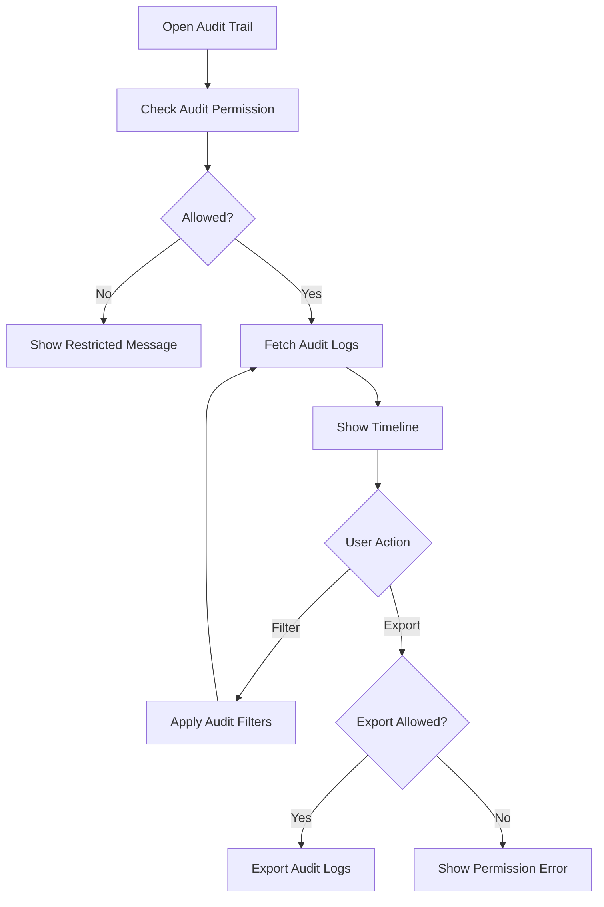
```mermaid
flowchart TD
    A[Open Audit Trail] --> B[Check Audit Permission]
    B --> C{Allowed?}
    C -- No --> D[Show Restricted Message]
    C -- Yes --> E[Fetch Audit Logs]
    E --> F[Show Timeline]
    F --> G{User Action}
    G -- Filter --> H[Apply Audit Filters]
    H --> E
    G -- Export --> I{Export Allowed?}
    I -- Yes --> J[Export Audit Logs]
    I -- No --> K[Show Permission Error]
```

---

# 5. Edge Case Flows

---

# 5.1 Network Failure Flow

### Numbered Flow

1. **User performs action** → Frontend sends API request.
2. **Network fails or request times out** → Frontend detects failure.
3. **System checks if action is retryable**.
4. **IF retryable** → Screen shows retry button.
5. **IF upload was in progress** → Screen shows “Upload interrupted. Please retry.”
6. **IF search was in progress** → Screen shows “Search failed. Try again.”
7. **System logs client-side failure** if logging is enabled.
8. **User clicks Retry** → System repeats request.

### Mermaid Diagram

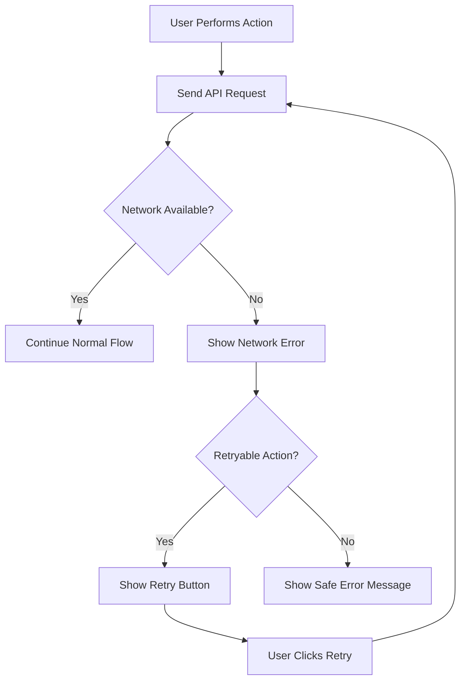
```mermaid
flowchart TD
    A[User Performs Action] --> B[Send API Request]
    B --> C{Network Available?}
    C -- Yes --> D[Continue Normal Flow]
    C -- No --> E[Show Network Error]
    E --> F{Retryable Action?}
    F -- Yes --> G[Show Retry Button]
    F -- No --> H[Show Safe Error Message]
    G --> I[User Clicks Retry]
    I --> B
```

---

# 5.2 Empty State Flow

### Numbered Flow

1. **User opens Documents, Results, Alerts, or Audit screen** → System fetches data.
2. **System receives empty response**.
3. **Screen shows contextual empty state**:
   - Documents: “No documents uploaded yet.”
   - Search: “No similar documents found.”
   - Alerts: “No duplicate or fraud alerts.”
   - Audit: “No activity yet.”
4. **Screen shows next best action**:
   - Upload document
   - Clear filters
   - Change search threshold
   - Invite users

### Mermaid Diagram

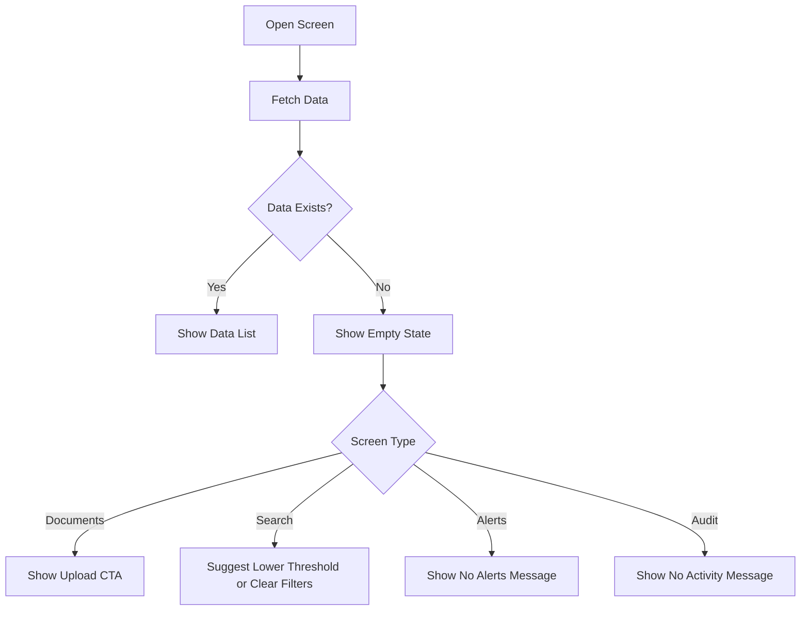
```mermaid
flowchart TD
    A[Open Screen] --> B[Fetch Data]
    B --> C{Data Exists?}
    C -- Yes --> D[Show Data List]
    C -- No --> E[Show Empty State]
    E --> F{Screen Type}
    F -- Documents --> G[Show Upload CTA]
    F -- Search --> H[Suggest Lower Threshold or Clear Filters]
    F -- Alerts --> I[Show No Alerts Message]
    F -- Audit --> J[Show No Activity Message]
```

---

# 5.3 Permission Denied Flow

### Numbered Flow

1. **User tries restricted action** → System checks role and permission.
2. **IF permission exists** → System continues action.
3. **ELSE system blocks request**.
4. **Screen shows “You do not have permission to access this.”**
5. **System hides restricted buttons in future UI rendering**.
6. **System records denied access attempt in audit log if needed.**

### Mermaid Diagram

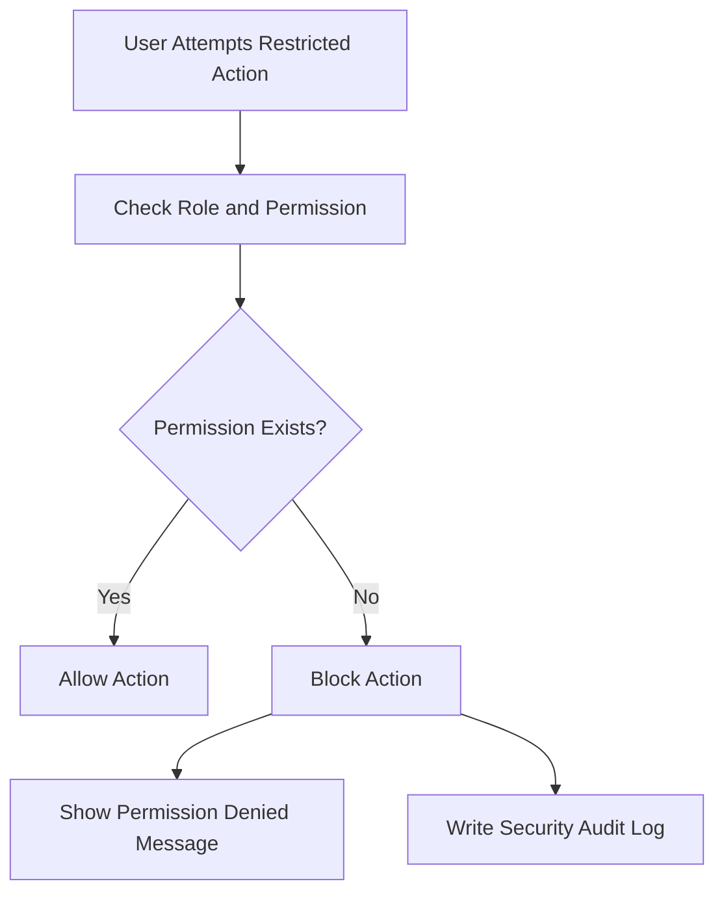
```mermaid
flowchart TD
    A[User Attempts Restricted Action] --> B[Check Role and Permission]
    B --> C{Permission Exists?}
    C -- Yes --> D[Allow Action]
    C -- No --> E[Block Action]
    E --> F[Show Permission Denied Message]
    E --> G[Write Security Audit Log]
```

---

# 5.4 Session Expiry Flow

### Numbered Flow

1. **User performs authenticated action** → Frontend sends access token.
2. **Backend returns token expired response**.
3. **Frontend attempts token refresh**.
4. **IF refresh succeeds** → Original request is retried.
5. **IF refresh fails** → System clears local session.
6. **Screen redirects to Login**.
7. **Screen shows “Session expired. Please login again.”**

### Mermaid Diagram

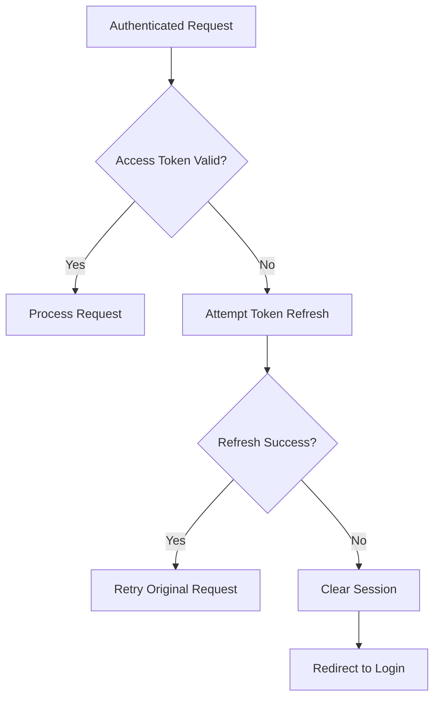
```mermaid
flowchart TD
    A[Authenticated Request] --> B{Access Token Valid?}
    B -- Yes --> C[Process Request]
    B -- No --> D[Attempt Token Refresh]
    D --> E{Refresh Success?}
    E -- Yes --> F[Retry Original Request]
    E -- No --> G[Clear Session]
    G --> H[Redirect to Login]
```

---

# 5.5 OCR Failure Flow

### Numbered Flow

1. **System detects scanned document** → Sends file to OCR.
2. **OCR returns no readable text or low confidence**.
3. **System marks document as OCR failed or low confidence**.
4. **Screen shows warning: “Text extraction failed or may be inaccurate.”**
5. **User can retry upload with clearer file**.
6. **User can manually enter metadata**.
7. **System stores manual metadata and audit log.**

### Mermaid Diagram

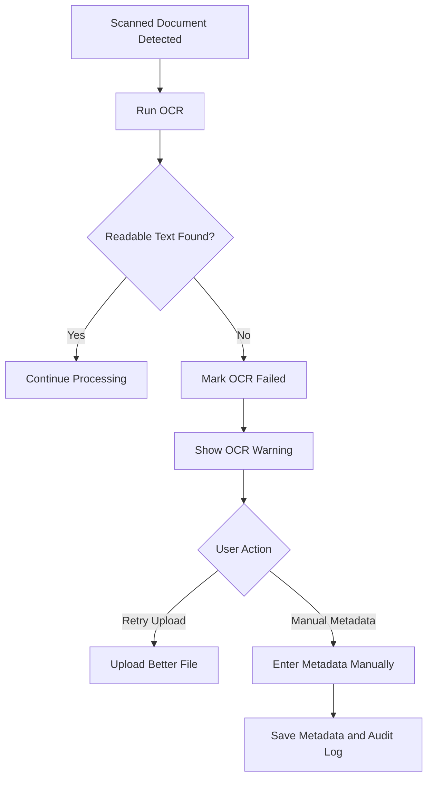
```mermaid
flowchart TD
    A[Scanned Document Detected] --> B[Run OCR]
    B --> C{Readable Text Found?}
    C -- Yes --> D[Continue Processing]
    C -- No --> E[Mark OCR Failed]
    E --> F[Show OCR Warning]
    F --> G{User Action}
    G -- Retry Upload --> H[Upload Better File]
    G -- Manual Metadata --> I[Enter Metadata Manually]
    I --> J[Save Metadata and Audit Log]
```

---

# 5.6 Embedding Service Failure Flow

### Numbered Flow

1. **Backend sends text chunks to embedding service**.
2. **Embedding service is unavailable or times out**.
3. **System marks document indexing as pending**.
4. **Screen shows “Document uploaded, but similarity indexing is pending.”**
5. **Background retry job attempts embedding generation again**.
6. **IF retry succeeds** → System updates document status to searchable.
7. **IF retry fails repeatedly** → System marks indexing failed and alerts admin.

### Mermaid Diagram

```mermaid
flowchart TD
    A[Send Chunks to Embedding Service] --> B{Embedding Service Available?}
    B -- Yes --> C[Generate Vectors]
    C --> D[Continue Qdrant Storage]
    B -- No --> E[Mark Indexing Pending]
    E --> F[Show Pending Indexing Message]
    E --> G[Background Retry]
    G --> H{Retry Successful?}
    H -- Yes --> I[Mark Document Searchable]
    H -- No --> J[Mark Indexing Failed]
    J --> K[Notify Admin]
```

---

# 5.7 Qdrant Failure Flow

### Numbered Flow

1. **System tries to store or search vectors in Qdrant**.
2. **Qdrant is unreachable**.
3. **IF action is upload** → Store document metadata in PostgreSQL and mark vector status as pending.
4. **IF action is search** → Show “Similarity search is temporarily unavailable.”
5. **System logs Qdrant failure**.
6. **Admin dashboard shows service health warning.**

### Mermaid Diagram

```mermaid
flowchart TD
    A[Call Qdrant] --> B{Qdrant Available?}
    B -- Yes --> C[Continue Vector Operation]
    B -- No --> D{Operation Type}
    D -- Upload --> E[Save Metadata and Mark Vector Pending]
    D -- Search --> F[Show Search Unavailable]
    E --> G[Log Failure]
    F --> G
    G --> H[Show Admin Health Warning]
```

---

# 6. Admin / Internal Flows

---

# 6.1 Admin User Management Flow

## Entry Point

Admin Dashboard → Users

### Numbered Flow

1. **Admin opens Users screen** → System checks admin permission.
2. **System loads user list** → Screen shows name, email, role, status.
3. **Admin clicks Add User** → Screen shows user creation form.
4. **Admin enters user details and role** → System validates input.
5. **System creates user** → Sends invitation email.
6. **Admin can edit role** → System updates user permissions.
7. **Admin can deactivate user** → System disables login.
8. **System writes audit log for every admin action**.

### Mermaid Diagram

```mermaid
flowchart TD
    A[Admin Opens Users Screen] --> B[Check Admin Permission]
    B --> C{Allowed?}
    C -- No --> D[Show Permission Denied]
    C -- Yes --> E[Load User List]
    E --> F{Admin Action}
    F -- Add User --> G[Create User Form]
    G --> H[Create User and Send Invite]
    F -- Edit Role --> I[Update Role and Permissions]
    F -- Deactivate --> J[Disable User Login]
    H --> K[Write Audit Log]
    I --> K
    J --> K
```

---

# 6.2 Role & Permission Management Flow

### Numbered Flow

1. **Admin opens Roles screen** → System loads existing roles.
2. **Admin selects role** → Screen shows permission matrix.
3. **Admin updates permissions** → System validates critical permission rules.
4. **IF invalid configuration** → Screen shows validation warning.
5. **ELSE system saves role**.
6. **System refreshes permissions for affected users**.
7. **Audit log records changes.**

### Mermaid Diagram

```mermaid
flowchart TD
    A[Open Roles Screen] --> B[Load Roles]
    B --> C[Select Role]
    C --> D[Show Permission Matrix]
    D --> E[Update Permissions]
    E --> F{Valid Configuration?}
    F -- No --> G[Show Validation Warning]
    F -- Yes --> H[Save Role]
    H --> I[Refresh User Permissions]
    I --> J[Write Audit Log]
```

---

# 6.3 Internal Document Processing Flow

This flow is executed by backend services after upload.

### Numbered Flow

1. **Backend receives uploaded document** → Creates document record.
2. **Parser service detects file type**.
3. **System extracts text using PDF/DOCX/TXT parser**.
4. **IF extracted text is empty** → System runs OCR.
5. **System cleans text**.
6. **System extracts metadata**.
7. **System chunks text**.
8. **System calls embedding service**.
9. **System stores vectors in Qdrant**.
10. **System stores metadata and status in PostgreSQL**.
11. **System writes audit log**.
12. **System updates document status to searchable.**

### Mermaid Diagram

```mermaid
flowchart TD
    A[Receive Uploaded Document] --> B[Create Document Record]
    B --> C[Detect File Type]
    C --> D[Extract Text]
    D --> E{Text Empty?}
    E -- Yes --> F[Run OCR]
    E -- No --> G[Clean Text]
    F --> G
    G --> H[Extract Metadata]
    H --> I[Chunk Text]
    I --> J[Generate Embeddings]
    J --> K[Store Vectors in Qdrant]
    K --> L[Store Metadata in PostgreSQL]
    L --> M[Write Audit Log]
    M --> N[Mark Document Searchable]
```

---

# 6.4 Background Re-indexing Flow

### Numbered Flow

1. **Admin triggers re-indexing or scheduled job starts**.
2. **System fetches documents with failed/pending/stale embeddings**.
3. **System processes documents one by one**.
4. **For each document, system regenerates embeddings**.
5. **System updates Qdrant vectors**.
6. **IF successful** → Mark document indexed.
7. **IF failed** → Increment retry count.
8. **IF retry limit exceeded** → Mark failed and notify admin.

### Mermaid Diagram

```mermaid
flowchart TD
    A[Start Re-indexing Job] --> B[Fetch Pending or Stale Documents]
    B --> C{Documents Found?}
    C -- No --> D[End Job]
    C -- Yes --> E[Process Next Document]
    E --> F[Regenerate Embeddings]
    F --> G[Update Qdrant Vectors]
    G --> H{Success?}
    H -- Yes --> I[Mark Indexed]
    H -- No --> J[Increment Retry Count]
    J --> K{Retry Limit Exceeded?}
    K -- Yes --> L[Mark Failed and Notify Admin]
    K -- No --> E
    I --> E
```

---

# 6.5 Retention & Deletion Flow

Financial documents may need retention policies and deletion/erasure support.

### Numbered Flow

1. **Admin opens Retention Settings** → System shows configured retention period.
2. **Admin updates retention period** → System validates policy.
3. **Scheduled retention job runs** → System finds expired documents.
4. **System checks legal hold / approval status**.
5. **IF document is under legal hold** → Skip deletion.
6. **ELSE document is archived or deleted based on policy**.
7. **System deletes vectors from Qdrant**.
8. **System updates PostgreSQL metadata**.
9. **System writes audit log.**

### Mermaid Diagram

```mermaid
flowchart TD
    A[Retention Job Starts] --> B[Find Expired Documents]
    B --> C{Expired Documents Found?}
    C -- No --> D[End Job]
    C -- Yes --> E[Check Legal Hold]
    E --> F{Legal Hold?}
    F -- Yes --> G[Skip Document]
    F -- No --> H{Policy}
    H -- Archive --> I[Archive Document]
    H -- Delete --> J[Delete File]
    I --> K[Remove or Archive Vectors]
    J --> K
    K --> L[Update Metadata]
    L --> M[Write Audit Log]
```

---

# 6.6 System Health Monitoring Flow

### Numbered Flow

1. **Admin opens System Health screen** → System checks backend, PostgreSQL, Qdrant, embedding service, OCR service.
2. **System displays service status**.
3. **IF all services are healthy** → Screen shows green status.
4. **IF any service is down** → Screen shows warning and affected features.
5. **Admin clicks service detail** → System shows logs, latency, failure count.
6. **Admin can trigger retry/re-index for failed documents.**

### Mermaid Diagram

```mermaid
flowchart TD
    A[Open System Health] --> B[Check Backend Health]
    B --> C[Check PostgreSQL]
    C --> D[Check Qdrant]
    D --> E[Check Embedding Service]
    E --> F[Check OCR Service]
    F --> G{All Healthy?}
    G -- Yes --> H[Show Healthy Status]
    G -- No --> I[Show Service Warning]
    I --> J[Show Affected Features]
    J --> K[Admin Opens Service Detail]
    K --> L[Show Logs and Failure Count]
```

---

# 7. Screen-Level Flow Map

## 7.1 Main Screens

| Screen | Purpose | Main Actions |
|---|---|---|
| Login | Authenticate user | Login, forgot password |
| Sign Up | Register user | Create account, verify email |
| Onboarding | First-time setup | Configure role, categories, thresholds |
| Dashboard | Main overview | Upload, search, view alerts |
| Upload Document | Upload finance documents | Select file, upload, view result |
| Search Similar | Find related documents | Upload/search/filter |
| Search Results | Show top matches | Open, compare, export |
| Document Detail | View document data | Find similar, compare, download |
| Document Comparison | Compare two docs | Mark duplicate, ignore, review |
| Alerts | Duplicate/fraud alerts | Review, assign, close |
| Approval Queue | Manager review | Approve, reject, hold |
| Audit Trail | Compliance history | Filter, export |
| Admin Users | User management | Add, edit, deactivate |
| Admin Roles | Permission management | Update role permissions |
| System Health | Service monitoring | View failures, retry |
| Retention Settings | Compliance deletion | Set retention rules |

---

# 8. Master Sitemap

```mermaid
flowchart TD
    A[Public Entry] --> B[Login]
    A --> C[Sign Up]
    B --> D[Forgot Password]
    C --> E[Email Verification]
    E --> B

    B --> F{First Login?}
    F -- Yes --> G[Onboarding]
    F -- No --> H[Dashboard]
    G --> H

    H --> I[Upload Document]
    H --> J[Search Similar]
    H --> K[Documents List]
    H --> L[Alerts]
    H --> M[Approval Queue]
    H --> N[Audit Trail]
    H --> O[Admin Dashboard]

    I --> P[Upload Processing Status]
    P --> Q[Document Detail]
    P --> J

    J --> R[Search Results]
    R --> Q
    R --> S[Document Comparison]

    K --> Q
    Q --> J
    Q --> S
    Q --> N

    L --> T[Alert Detail]
    T --> S
    T --> M

    M --> U[Review Detail]
    U --> Q
    U --> S

    O --> V[User Management]
    O --> W[Role Management]
    O --> X[System Health]
    O --> Y[Retention Settings]
    O --> Z[Re-indexing Jobs]

    X --> Z
```

---

# 9. Recommended Navigation Structure

```text
App
├── Auth
│   ├── Login
│   ├── Sign Up
│   ├── Forgot Password
│   └── Reset Password
│
├── Onboarding
│   ├── Welcome
│   ├── Role Setup
│   ├── Document Category Setup
│   ├── Search Settings
│   └── Sample Upload
│
├── Dashboard
│   ├── Recent Documents
│   ├── Duplicate Alerts
│   ├── Fraud Alerts
│   └── Recent Searches
│
├── Documents
│   ├── Upload Document
│   ├── Documents List
│   ├── Document Detail
│   ├── Document Comparison
│   └── Document Versions
│
├── Search
│   ├── Search Similar
│   ├── Search Results
│   └── Metadata Filters
│
├── Alerts
│   ├── Duplicate Alerts
│   ├── Fraud Alerts
│   └── Alert Detail
│
├── Workflow
│   ├── Approval Queue
│   ├── Review Detail
│   └── Approval History
│
├── Compliance
│   ├── Audit Trail
│   ├── Retention Rules
│   └── Export Logs
│
└── Admin
    ├── User Management
    ├── Role Management
    ├── System Health
    ├── Re-indexing Jobs
    └── Service Logs
```

---

# 10. Final Product Journey Summary ✨

The complete app journey is:

1. **User signs up or logs in**
2. **System verifies user and loads role permissions**
3. **First-time user completes onboarding**
4. **User uploads financial document**
5. **System extracts text using parser or OCR**
6. **System chunks text and generates embeddings**
7. **System stores vectors in Qdrant and metadata in PostgreSQL**
8. **User searches for similar documents**
9. **System returns top matches with similarity scores**
10. **User compares documents**
11. **System flags duplicates, anomalies, or fraud risks**
12. **Manager reviews alerts in approval workflow**
13. **Admin monitors users, roles, retention, audit logs, and service health**

This gives the project a complete product-level flow from **authentication → onboarding → document processing → similarity search → duplicate/fraud detection → admin/compliance operations**.
