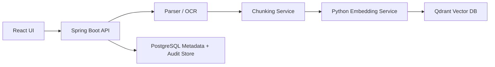
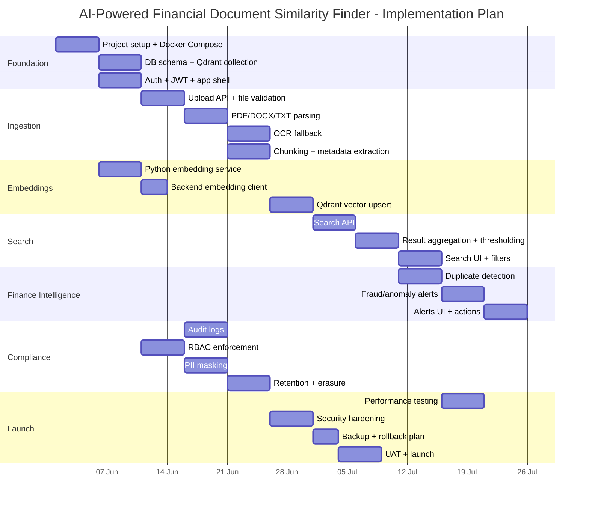
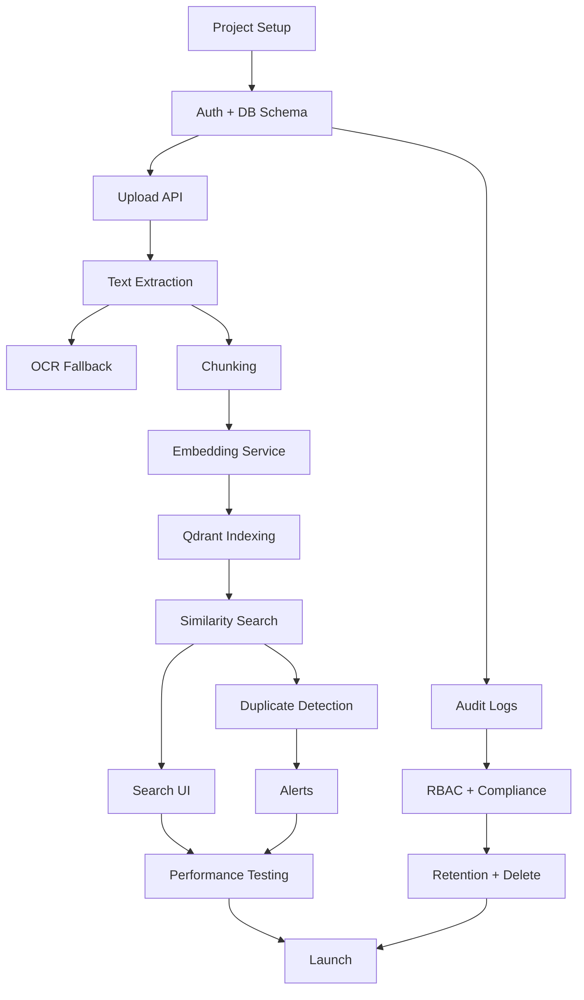

# Implementation Plan  
## AI-Powered Financial Document Similarity Finder 📄🔍

This plan assumes a **small team of 2–3 developers** building a local/on-premise system using **React + Spring Boot + Python embedding service + Qdrant + PostgreSQL + Tesseract OCR**.

The project scope is based on the product goal: upload financial documents, extract text, create embeddings, store vectors, search similar documents, detect duplicates/fraud, and maintain audit/compliance controls.

---

# 1. Project Phases

## Phase 1 — Foundation & Infrastructure

### Goal  
Create the technical base: local development setup, Docker services, backend skeleton, frontend skeleton, database schema, and basic authentication.

### Deliverables  
- Docker Compose setup for:
  - React frontend
  - Spring Boot backend
  - Python embedding service
  - Qdrant
  - PostgreSQL
- Backend project structure
- Frontend routing and layout
- PostgreSQL schema migration
- Qdrant collection setup with 384-dimensional cosine vectors
- JWT authentication foundation
- Health check APIs

### Architecture Direction

The system architecture should follow this flow:

---

## Phase 2 — Core Document Ingestion MVP

### Goal  
Allow users to upload documents, extract text, chunk content, generate embeddings, and store vectors plus metadata.

### Deliverables  
- `POST /api/documents/upload`
- File type and size validation
- PDF, DOCX, TXT text extraction
- OCR fallback for scanned documents
- Text chunking pipeline
- Python embedding service using `all-MiniLM-L6-v2`
- Qdrant upsert logic
- PostgreSQL document metadata records
- Upload progress UI

### Supported Upload Types

- PDF
- DOCX
- TXT
- PNG
- JPG / JPEG
- TIFF

---

## Phase 3 — Similarity Search MVP

### Goal  
Allow users to search similar financial documents by uploading a query document or selecting an existing document.

### Deliverables  
- `POST /api/documents/search`
- Query document extraction and embedding
- Qdrant cosine similarity search
- Top-K results, default top 5
- Similarity threshold, default `0.70`
- Chunk-level result aggregation by parent document
- Search Results screen
- Metadata filters:
  - vendor
  - currency
  - invoice date range
  - amount range
  - document type

---

## Phase 4 — Finance Intelligence

### Goal  
Add finance-specific capabilities that make the tool valuable beyond generic semantic search.

### Deliverables  
- Duplicate invoice detection
- Fraud/anomaly alert generation
- Vendor amount deviation checks
- Vendor embedding centroid outlier detection
- Alerts screen
- Alert actions:
  - dismiss
  - escalate
  - resolve
- Mandatory comment for manager action
- Document comparison API

### Core Detection Rules

| Detection Type | Rule |
|---|---|
| Confirmed duplicate | Similarity score above `0.90` and matching invoice number |
| Possible duplicate | Similarity score above configured threshold but invoice number differs |
| Vendor amount anomaly | Amount deviation above configured percentage, default `20%` |
| Vendor outlier | Document embedding significantly differs from vendor centroid |

---

## Phase 5 — Security, Audit & Compliance

### Goal  
Make the system safe for internal finance usage with auditability, role control, PII masking, and retention handling.

### Deliverables  
- RBAC for:
  - Finance Clerk
  - Finance Manager
  - Compliance Officer
- JWT session expiry, default 8 hours
- Audit log for upload, search, view, alert action, and deletion
- Audit Trail screen
- CSV audit export
- PII masking in UI
- Soft delete
- Retention policy support
- Right to Erasure workflow

### Mandatory Audit Events

- Document upload
- Document search
- Document view
- Alert action
- Document delete
- Export action
- Login success/failure

---

## Phase 6 — Polish, Performance & Launch

### Goal  
Prepare the product for real internal use.

### Deliverables  
- End-to-end testing
- Security testing
- Performance benchmark
- Monitoring dashboard
- Error handling and retry strategy
- Backup and restore process
- Production Docker deployment
- Rollback plan
- User documentation
- Admin documentation

### Performance Targets

| Area | Target |
|---|---|
| Search response | Under 500 ms for top-5 results over 100,000 chunks |
| 10 MB PDF indexing | Within 30 seconds including OCR |
| Concurrent users | At least 50 users |
| Availability target | 99%+ for internal deployment |

---

# 2. Milestone Table

| Milestone | Description | Dependencies | Estimated Duration | Owner Role |
|---|---|---|---|---|
| M1 — Project Setup | Initialize React, Spring Boot, Python service, Docker Compose, PostgreSQL, Qdrant | None | 1 week | Full-stack Dev + Backend Dev |
| M2 — Auth & Base App Shell | Login, JWT auth, protected routes, base navigation | M1 | 1 week | Full-stack Dev |
| M3 — Metadata Schema | Create users, roles, documents, chunks, audit logs, alerts tables | M1 | 1 week | Backend Dev |
| M4 — Upload Pipeline | Upload API, file validation, file storage, parser integration | M1, M3 | 1–2 weeks | Backend Dev |
| M5 — OCR Pipeline | Tesseract integration for scanned docs and image files | M4 | 1 week | Backend Dev |
| M6 — Embedding Service | Python API with Sentence Transformers, 384-dim vector output | M1 | 1 week | ML/Python Dev |
| M7 — Qdrant Indexing | Create collection, upsert vectors with metadata payload | M4, M6 | 1 week | Backend Dev |
| M8 — Similarity Search | Search API, top-K retrieval, thresholding, aggregation | M6, M7 | 1–2 weeks | Backend Dev |
| M9 — Search UI | Upload/select query document, filters, result cards | M8 | 1 week | Frontend Dev |
| M10 — Duplicate Detection | Similarity > 0.90 + matching invoice number logic | M8 | 1 week | Backend Dev |
| M11 — Alerts Module | Duplicate/fraud alerts screen and alert lifecycle | M10 | 1–2 weeks | Full-stack Dev |
| M12 — Audit Trail | Immutable audit logs, filter screen, CSV export | M3, M8, M11 | 1 week | Backend + Frontend Dev |
| M13 — RBAC & PII Masking | Role permissions, field masking, restricted screens | M2, M12 | 1 week | Full-stack Dev |
| M14 — Retention & Delete | Soft delete, retention rules, right-to-erasure workflow | M13 | 1 week | Backend Dev |
| M15 — Performance & Security Hardening | Load test, malware scan, API hardening, monitoring | M8–M14 | 1–2 weeks | All Devs |
| M16 — Launch Readiness | Docs, backups, rollback, UAT, production deployment | M15 | 1 week | Tech Lead / Full Team |

---

# 3. Sprint Breakdown

Assumption: **10 sprints**, each **1 week**. For a 2-person team, some sprints may stretch to 2 weeks.

---

## Phase 1 — Foundation & Infrastructure

## Sprint 1 — Project Bootstrap

### Goal  
Get all base services running locally.

### Tickets  

| Priority | Ticket |
|---|---|
| P0 | Create mono-repo or multi-repo structure for frontend, backend, embedding service, and deployment configs |
| P0 | Create Spring Boot backend project with modules: `controller`, `service`, `repository`, `security`, `parser`, `vector`, `audit` |
| P0 | Create React app using Vite with routing and base layout |
| P0 | Create Python FastAPI embedding service skeleton |
| P0 | Create Docker Compose with PostgreSQL, Qdrant, backend, frontend, embedding service |
| P0 | Create `/api/health` endpoint in Spring Boot |
| P0 | Create `/health` endpoint in Python embedding service |
| P1 | Add `.env.example` files for all services |
| P1 | Add basic logging configuration |
| P2 | Add Makefile or shell scripts for local startup |

---

## Sprint 2 — Database, Auth & App Shell

### Goal  
Create secure access foundation and metadata storage.

### Tickets  

| Priority | Ticket |
|---|---|
| P0 | Create PostgreSQL schema migrations for `users`, `roles`, `documents`, `document_chunks`, `audit_logs`, `alerts` |
| P0 | Build `POST /api/auth/login` endpoint with JWT response |
| P0 | Build `POST /api/auth/refresh` endpoint |
| P0 | Add Spring Security JWT middleware |
| P0 | Create React Login screen |
| P0 | Add protected frontend routes |
| P0 | Seed default roles: `FINANCE_CLERK`, `FINANCE_MANAGER`, `COMPLIANCE_OFFICER` |
| P1 | Build basic User Management API placeholder |
| P1 | Add logout and token expiry handling |
| P2 | Add password reset placeholder screens |

---

# Phase 2 — Core Document Ingestion MVP

## Sprint 3 — Upload API & File Parsing

### Goal  
Allow users to upload financial documents and extract text from digital files.

### Tickets  

| Priority | Ticket |
|---|---|
| P0 | Build `POST /api/documents/upload` endpoint |
| P0 | Add file type validation for PDF, DOCX, TXT, PNG, JPG, TIFF |
| P0 | Add max file size validation, default 50 MB |
| P0 | Store original uploaded file in local secure storage |
| P0 | Extract text from PDF using Apache PDFBox |
| P0 | Extract text from DOCX using Apache POI |
| P0 | Extract text from TXT files |
| P0 | Create document metadata record in PostgreSQL |
| P0 | Add audit log entry for upload attempt and upload success/failure |
| P1 | Add frontend drag-and-drop upload component |
| P1 | Show upload progress indicator |
| P2 | Add document preview placeholder |

---

## Sprint 4 — OCR, Chunking & Metadata Extraction

### Goal  
Complete the ingestion pipeline for scanned and image-based documents.

### Tickets  

| Priority | Ticket |
|---|---|
| P0 | Integrate Tesseract OCR for scanned PDFs and image files |
| P0 | Add fallback rule: if parser returns empty/low text, run OCR |
| P0 | Build text cleaning service to normalize whitespace and remove noise |
| P0 | Build chunking service with configurable 500–1000 character chunks |
| P0 | Extract basic metadata: filename, document type, uploaded by, upload timestamp |
| P1 | Extract invoice number using regex patterns |
| P1 | Extract vendor name from first-page heuristics |
| P1 | Extract invoice date, currency, and total amount |
| P1 | Save extracted metadata to PostgreSQL |
| P2 | Add manual metadata correction UI |

---

# Phase 3 — Embedding & Search MVP

## Sprint 5 — Embedding Service & Qdrant Indexing

### Goal  
Generate embeddings and store vectors in Qdrant.

### Tickets  

| Priority | Ticket |
|---|---|
| P0 | Implement Python `POST /embed` endpoint |
| P0 | Load `sentence-transformers/all-MiniLM-L6-v2` model |
| P0 | Return 384-dimensional float vector per text chunk |
| P0 | Add backend client for embedding service |
| P0 | Create Qdrant collection `financial_documents` with cosine distance |
| P0 | Upsert chunk vectors into Qdrant with metadata payload |
| P0 | Prevent duplicate indexing by checking `document_id` |
| P1 | Add retry handling when embedding service is unavailable |
| P1 | Add indexing status field: `PENDING`, `PROCESSING`, `INDEXED`, `FAILED` |
| P2 | Add admin re-index endpoint |

---

## Sprint 6 — Similarity Search API & UI

### Goal  
Search for similar documents and show ranked results.

### Tickets  

| Priority | Ticket |
|---|---|
| P0 | Build `POST /api/documents/search` endpoint |
| P0 | Support query document upload for search |
| P0 | Reuse extraction → chunking → embedding pipeline for query document |
| P0 | Query Qdrant using cosine similarity |
| P0 | Return top-K results, default 5 |
| P0 | Apply similarity threshold, default 0.70 |
| P0 | Aggregate chunk-level matches into unique parent documents |
| P0 | Return filename, similarity score, vendor, invoice number, snippet |
| P0 | Build Search Similar screen |
| P0 | Build Search Results screen |
| P1 | Add metadata filters to API |
| P1 | Add metadata filters to UI |
| P2 | Add “search by text” mode |

---

# Phase 4 — Finance Intelligence

## Sprint 7 — Document List, Detail & Compare

### Goal  
Make uploaded documents searchable, viewable, and comparable.

### Tickets  

| Priority | Ticket |
|---|---|
| P0 | Build `GET /api/documents` with pagination, sorting, and filters |
| P0 | Build `GET /api/documents/{id}` document detail endpoint |
| P0 | Build Document List screen |
| P0 | Build Document Detail screen |
| P0 | Show metadata, indexing status, upload user, and upload date |
| P0 | Build `POST /api/documents/compare` endpoint |
| P1 | Show similarity history on document detail |
| P1 | Add “Find Similar” action from document detail |
| P2 | Add side-by-side document comparison UI |

---

## Sprint 8 — Duplicate & Fraud Alerts

### Goal  
Surface duplicate and anomaly risks to finance managers.

### Tickets  

| Priority | Ticket |
|---|---|
| P0 | Implement confirmed duplicate rule: similarity > 0.90 and matching invoice number |
| P0 | Create alert record when duplicate is detected |
| P0 | Implement vendor amount deviation rule, default threshold 20% |
| P0 | Build `GET /api/alerts` endpoint |
| P0 | Build Alerts screen |
| P0 | Add alert status values: `OPEN`, `DISMISSED`, `ESCALATED`, `RESOLVED` |
| P0 | Build alert action endpoint with mandatory comment |
| P1 | Add vendor embedding centroid outlier detection |
| P1 | Add Alert Detail screen |
| P2 | Add alert notification placeholders for email/Slack |

---

# Phase 5 — Security, Audit & Compliance

## Sprint 9 — RBAC, Audit Trail & Compliance

### Goal  
Secure sensitive finance workflows and provide audit visibility.

### Tickets  

| Priority | Ticket |
|---|---|
| P0 | Enforce role-based access on backend endpoints |
| P0 | Restrict upload/search to Finance Clerk and above |
| P0 | Restrict alerts, audit logs, and user management to Manager/Compliance roles |
| P0 | Restrict retention and PII settings to Compliance Officer |
| P0 | Add audit logging for upload, search, view, alert action, and deletion |
| P0 | Build `GET /api/audit/{documentId}` endpoint |
| P0 | Build Audit Trail screen with filters |
| P0 | Add CSV export for audit logs |
| P1 | Add UI field masking for sensitive data below Manager role |
| P1 | Add PII detection patterns for bank account numbers and sensitive IDs |
| P2 | Add advanced audit dashboard charts |

---

## Sprint 10 — Retention, Hardening & Launch

### Goal  
Prepare the product for production/internal rollout.

### Tickets  

| Priority | Ticket |
|---|---|
| P0 | Implement soft delete for documents |
| P0 | Delete or disable associated vectors when document is deleted |
| P0 | Implement retention policy configuration, 1–7 years |
| P0 | Build Right to Erasure workflow for Compliance Officer |
| P0 | Add malware scanning before processing uploaded files |
| P0 | Run performance test for 100,000 chunks |
| P0 | Run upload benchmark for 10 MB PDF |
| P0 | Add backend monitoring with Actuator/Prometheus-compatible metrics |
| P0 | Add backup script for PostgreSQL and Qdrant data |
| P0 | Write rollback plan |
| P0 | Complete launch checklist |
| P1 | Add system health screen for Admin |
| P1 | Add re-indexing jobs screen |
| P2 | Add analytics dashboard for adoption metrics |

---

# 4. Task Dependencies

## Mermaid Gantt

---

## Dependency List

| Task | Must Finish Before |
|---|---|
| Docker Compose setup | Backend, frontend, Qdrant, PostgreSQL, embedding service integration |
| PostgreSQL schema | Upload API, audit logs, alerts, document list |
| Qdrant collection setup | Vector indexing and similarity search |
| Auth/JWT | RBAC, protected screens, user-specific audit logs |
| Upload API | OCR, chunking, metadata extraction, audit logging |
| Parser/OCR pipeline | Embedding generation |
| Chunking service | Embedding generation and Qdrant indexing |
| Embedding service | Vector storage and similarity search |
| Qdrant indexing | Search API, duplicate detection |
| Search API | Search UI, duplicate detection, fraud scoring |
| Duplicate detection | Alerts module |
| Audit logging | Compliance reporting |
| RBAC | PII masking, retention policy access, admin screens |
| Retention policy | Launch readiness |
| Performance testing | Production launch |
| Backup and rollback | Production launch |

---

# 5. Tech Risks & Mitigations

| Risk | Likelihood | Impact | Mitigation |
|---|---:|---:|---|
| OCR accuracy is poor for low-quality scanned invoices | High | High | Define minimum scan quality, store OCR confidence, allow manual metadata correction, run OCR UAT with real invoices before launch |
| Search accuracy is not good enough for finance users | Medium | High | Build labeled duplicate dataset, tune threshold, test `all-MiniLM-L6-v2` first, evaluate larger models later |
| Search latency exceeds 500 ms at 100,000 chunks | Medium | High | Add Qdrant payload indexes, tune top-K, batch embeddings, cache common searches, run load test before launch |
| Embedding service becomes bottleneck during bulk uploads | Medium | Medium | Add async indexing queue, indexing status, retry mechanism, and optional batching |
| Role/PII/compliance rules are unclear | Medium | High | Finalize permission matrix before Sprint 9, review with Compliance Officer, add automated tests for restricted endpoints |

---

# 6. Definition of Done

## Phase 1 — Foundation Done When

- All services start using one Docker Compose command.
- React frontend can call Spring Boot backend.
- Backend can call Python embedding service.
- Backend can connect to PostgreSQL.
- Backend can connect to Qdrant.
- `/api/health` returns service status.
- Basic JWT login works.
- Migrations run successfully on a clean database.

---

## Phase 2 — Ingestion Done When

- Supported files can be uploaded.
- Unsupported files are rejected with clear errors.
- Large files are rejected based on configured limit.
- Digital PDFs, DOCX, and TXT files extract text correctly.
- Scanned files trigger OCR fallback.
- Extracted text is cleaned and chunked.
- Document metadata is saved.
- Upload events are audit logged.
- Upload UI shows success/failure/progress.

---

## Phase 3 — Similarity Search Done When

- Query documents follow the same extraction and embedding pipeline.
- Qdrant returns top-K similar chunks.
- Backend aggregates chunks into unique document results.
- Similarity threshold is configurable.
- Results show score, filename, vendor, invoice number, and snippet.
- Metadata filters work.
- Search event is audit logged.
- Top-5 search result target is validated against test corpus.

---

## Phase 4 — Finance Intelligence Done When

- Duplicate detection rule works.
- Fraud amount deviation alerts work.
- Alert records are created correctly.
- Alerts screen displays active alerts.
- Managers can dismiss, escalate, or resolve alerts.
- Alert action requires mandatory comment.
- Alert lifecycle is audit logged.
- False positive cases are reviewed with finance users.

---

## Phase 5 — Security & Compliance Done When

- Role permissions are enforced on backend and frontend.
- Unauthorized users cannot access restricted APIs.
- Audit trail is immutable from normal UI/API paths.
- Audit logs are searchable and exportable.
- Sensitive data is masked for lower roles.
- Soft delete works.
- Retention policy jobs work.
- Right to Erasure deletes document metadata and vectors as required.

---

## Phase 6 — Launch Done When

- All P0 bugs are closed.
- UAT is signed off by finance users.
- Security audit is complete.
- Performance test meets agreed targets.
- Monitoring is active.
- Backup and restore are tested.
- Rollback plan is documented.
- Admin and user guides are ready.
- Production deployment is tested in staging first.

---

# 7. Launch Checklist

## Security Audit

- [ ] JWT expiry and refresh token flow verified  
- [ ] Password hashing verified  
- [ ] Role-based access tested for all endpoints  
- [ ] Sensitive fields masked for lower roles  
- [ ] File upload validation tested  
- [ ] Malware scanning enabled before document processing  
- [ ] API rate limiting configured  
- [ ] CORS restricted to approved frontend URL  
- [ ] Secrets removed from codebase  
- [ ] `.env` files excluded from Git  
- [ ] Audit logs cannot be edited through normal APIs  

---

## Performance Test

- [ ] Test search with 10,000 chunks  
- [ ] Test search with 50,000 chunks  
- [ ] Test search with 100,000 chunks  
- [ ] Confirm top-5 search response under 500 ms  
- [ ] Test 10 MB PDF indexing within 30 seconds  
- [ ] Test OCR-heavy document processing  
- [ ] Test 50 concurrent users  
- [ ] Test Qdrant restart recovery  
- [ ] Test embedding service under batch upload load  

---

## Monitoring Setup

- [ ] Spring Boot Actuator enabled  
- [ ] Backend API latency metrics captured  
- [ ] Upload processing time tracked  
- [ ] OCR processing failures tracked  
- [ ] Embedding service errors tracked  
- [ ] Qdrant availability monitored  
- [ ] PostgreSQL availability monitored  
- [ ] Disk usage alerts configured  
- [ ] Failed indexing jobs visible to admin  
- [ ] Error logs centralized or exportable  

---

## Documentation

- [ ] Developer setup guide  
- [ ] Docker Compose setup guide  
- [ ] API documentation  
- [ ] Database schema document  
- [ ] User guide for Finance Clerk  
- [ ] Manager guide for alerts  
- [ ] Compliance guide for audit and retention  
- [ ] Admin guide for users, roles, and re-indexing  
- [ ] Troubleshooting guide  
- [ ] Known limitations documented  

---

## Backup Strategy

- [ ] PostgreSQL daily backup configured  
- [ ] Qdrant snapshot backup configured  
- [ ] Uploaded file storage backup configured  
- [ ] Backup retention policy defined  
- [ ] Restore process tested  
- [ ] Backup encryption enabled  
- [ ] Backup location access restricted  
- [ ] Disaster recovery owner assigned  

---

## Rollback Plan

- [ ] Previous Docker image versions retained  
- [ ] Database migration rollback scripts prepared  
- [ ] Qdrant snapshot restore tested  
- [ ] Feature flags available for OCR, fraud alerts, and retention jobs  
- [ ] Maintenance page or downtime message prepared  
- [ ] Rollback decision owner assigned  
- [ ] Rollback checklist tested in staging  

---

# Recommended Ruthless MVP Scope 🎯

For the first usable release, keep only these **P0** capabilities:

1. Login with JWT  
2. Upload PDF/DOCX/TXT  
3. OCR fallback for scanned documents  
4. Chunk text  
5. Generate embeddings  
6. Store vectors in Qdrant  
7. Store metadata in PostgreSQL  
8. Search similar documents  
9. Show top 5 results  
10. Audit uploads and searches  
11. Basic duplicate detection  
12. Basic RBAC  

Everything else — dashboards, workflow approvals, advanced fraud scoring, export features, and analytics — should come after the MVP is stable.

---

# Suggested Team Allocation

## Developer 1 — Backend Lead

Owns:

- Spring Boot API
- PostgreSQL schema
- Upload pipeline
- Qdrant integration
- Auth/RBAC
- Audit logs

## Developer 2 — Frontend + Integration

Owns:

- React UI
- Upload screen
- Search screen
- Results screen
- Alerts screen
- Audit screen
- API integration

## Developer 3 — Python/ML + DevOps

Owns:

- Python embedding service
- OCR pipeline support
- Docker Compose
- Performance testing
- Monitoring
- Backup and deployment scripts

If only 2 developers are available, Developer 1 should own backend + DevOps, while Developer 2 owns frontend + Python embedding service integration.

---

# Final Build Order Recommendation

