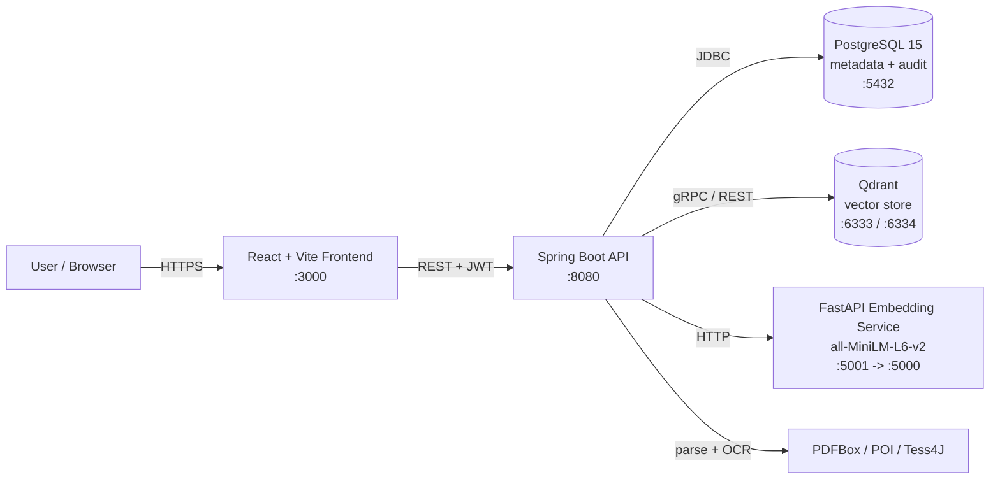

# AI-Powered Financial Document Similarity Finder

> A locally deployed, on-premise semantic search platform that helps finance teams manage, retrieve, and audit financial documents — invoices, receipts, purchase orders, bank statements, and payment records — using vector embeddings instead of brittle keyword matching.

<p align="left">
  
  
  
  
  
  
</p>

---

## Table of Contents

- [Overview](#overview)
- [Key Features](#key-features)
- [Architecture](#architecture)
- [Tech Stack](#tech-stack)
- [Repository Structure](#repository-structure)
- [Prerequisites](#prerequisites)
- [Quick Start (Docker)](#quick-start-docker)
- [Local Development](#local-development)
- [Environment Variables](#environment-variables)
- [API Reference](#api-reference)
- [Default Roles & Seeded Admin](#default-roles--seeded-admin)
- [Database Schema](#database-schema)
- [Testing](#testing)
- [Makefile Commands](#makefile-commands)
- [Project Documentation](#project-documentation)
- [Roadmap](#roadmap)

---

## Overview

Traditional document management relies on exact-match search, rigid folders, and manual review — all of which break down at scale and miss subtle patterns like duplicate invoices with reworded text or fraudulent bills mimicking legitimate ones.

This system converts every uploaded document into a 384-dimensional vector embedding and runs **semantic similarity search**, surfacing related documents even when the wording differs. It supports OCR for scanned files, duplicate detection, fraud/anomaly flagging, role-based access control, and tamper-resistant audit logging. The platform runs **entirely on-premise with no cloud dependencies**, supporting compliance with GDPR, PII handling, and 1–7 year retention policies.

## Key Features

- **Semantic similarity search** — upload a query document and find the most similar stored documents by meaning, not keywords.
- **Multi-format ingestion** — PDF (Apache PDFBox), Office documents (Apache POI), and plain text, with **OCR for scanned documents** (Tesseract via Tess4J).
- **Document chunking & embeddings** — text is cleaned, chunked, and embedded with `sentence-transformers/all-MiniLM-L6-v2`.
- **Duplicate detection & fraud flagging** — dedicated services surface duplicate invoices and anomalous documents, raising alerts.
- **Metadata extraction** — vendor, amount, currency, and dates are extracted and made filterable.
- **Role-based access control** — JWT authentication with five roles (admin, finance manager, finance clerk, auditor, viewer).
- **Tamper-resistant audit trail** — every upload and search is logged for compliance.
- **Retention policies** — per-document-type retention with configurable expiry actions.

## Architecture

The system is composed of five containerized services orchestrated with Docker Compose.



**Request flow (upload):** file → backend parses & OCRs text → text cleaning → chunking → embedding service returns vectors → vectors stored in Qdrant, metadata stored in PostgreSQL → duplicate/fraud checks run → audit log written.

**Request flow (search):** query file → embedded → nearest-neighbour lookup in Qdrant filtered by metadata → ranked results returned with similarity scores.

## Tech Stack

| Layer | Technology |
|---|---|
| **Frontend** | React 18, Vite 6, React Router 6, Axios, lucide-react |
| **Backend** | Java 21, Spring Boot 3.3 (Web, WebFlux, Data JPA, Security, Validation) |
| **Auth** | JWT (jjwt 0.12.5), Spring Security |
| **Document parsing** | Apache PDFBox 3, Apache POI 5.2, Tess4J 5.11 (OCR) |
| **Embeddings** | Python, FastAPI, Uvicorn, sentence-transformers (`all-MiniLM-L6-v2`, 384-dim) |
| **Vector DB** | Qdrant |
| **Relational DB** | PostgreSQL 15 + Flyway migrations |
| **Infra** | Docker, Docker Compose, Nginx (frontend prod), Makefile |

## Repository Structure

```
.
├── backend/                 # Spring Boot API (Java 21, Maven)
│   ├── src/main/java/com/fintech/simdocfinder/
│   │   ├── controller/      # REST controllers (auth, documents, alerts, audit, users, health)
│   │   ├── service/         # Business logic (search, chunking, duplicate & fraud detection, retention, audit)
│   │   ├── parser/          # PDF / DOCX / text parsers
│   │   ├── ocr/             # OCR service (Tesseract)
│   │   ├── embedding/       # Client for the Python embedding service
│   │   ├── vector/          # Qdrant integration
│   │   ├── security/        # JWT filter, token provider, security config
│   │   ├── model/           # JPA entities + DTOs
│   │   └── repository/      # Spring Data repositories
│   └── src/main/resources/
│       ├── application.yml
│       └── db/migration/    # Flyway SQL (V1__initial_schema.sql)
├── embedding-service/       # FastAPI microservice (Sentence Transformers)
│   ├── main.py              # /health, /embed, /embed-batch endpoints
│   └── tests/
├── frontend/                # React + Vite SPA
│   └── src/
│       ├── pages/           # Dashboard, Upload, Search, Documents, Alerts, Audit, Settings, Login
│       ├── components/      # Layout, Search, Upload, common UI
│       ├── api/             # Axios API clients
│       └── contexts/        # Auth context
├── Docs/                    # PRD, TRD, app-flow, schema, UX brief, implementation plan
├── scripts/                 # backup / restore / benchmark / test SQL
├── docker-compose.yml       # Local stack
├── docker-compose.prod.yml  # Production stack
├── Makefile                 # Developer convenience commands
└── .env.example             # Environment variable template
```

## Prerequisites

- **Docker** and **Docker Compose** (recommended path — runs everything)

For local, non-Docker development you'll additionally need:

- **Java 21** (for the backend)
- **Node.js 18+** (for the frontend)
- **Python 3.10+** (for the embedding service)
- Running **PostgreSQL** and **Qdrant** instances

## Quick Start (Docker)

```bash
# 1. Clone the repository
git clone https://github.com/thoteniraj-coder/AI-Powered-Financial-Document-Similarity.git
cd AI-Powered-Financial-Document-Similarity

# 2. Create your environment file
cp .env.example .env
#    Edit .env and change all secrets (POSTGRES_PASSWORD, JWT_SECRET) before any real use.

# 3. Build and start the full stack
make up-build
#    (equivalent to: docker compose up -d --build)
```

Once the containers report healthy:

| Service | URL |
|---|---|
| Frontend | http://localhost:3000 |
| Backend API | http://localhost:8080/api |
| Backend health | http://localhost:8080/api/health |
| Embedding service | http://localhost:5001 |
| Qdrant dashboard | http://localhost:6333/dashboard |
| PostgreSQL | localhost:5432 |

> The embedding service downloads the model on first start, so its health check has a longer startup window. Allow a minute or two on the first run.

Check status and logs:

```bash
make status      # docker compose ps
make logs        # tail all logs
make down        # stop everything
```

## Local Development

Run each service individually (useful for hot reload and debugging):

```bash
make dev-backend     # cd backend && ./mvnw spring-boot:run        (Java 21)
make dev-frontend    # cd frontend && npm run dev                  (Vite dev server)
make dev-embedding   # cd embedding-service && uvicorn main:app --reload --port 5000
```

You'll still need PostgreSQL and Qdrant available (the easiest way is to leave those two running via `docker compose up -d postgres qdrant`).

## Environment Variables

Copy `.env.example` to `.env` and adjust. Key variables:

| Variable | Default | Description |
|---|---|---|
| `POSTGRES_DB` | `fdsf_db` | Database name |
| `POSTGRES_USER` | `fdsf_user` | Database user |
| `POSTGRES_PASSWORD` | `fdsf_secret_2026` | **Change for any real deployment** |
| `JWT_SECRET` | `super-secret-...` | **Change for any real deployment** |
| `JWT_EXPIRATION_MS` | `86400000` | Token lifetime (24h) |
| `EMBEDDING_MODEL` | `all-MiniLM-L6-v2` | Sentence-transformers model |
| `FILE_STORAGE_PATH` | `/data/uploads` | Upload storage location |
| `MAX_FILE_SIZE_MB` | `50` | Max upload size |
| `QDRANT_HOST` / `QDRANT_PORT` | `localhost` / `6333` | Vector DB connection |
| `QDRANT_COLLECTION` | `financial_documents` | Qdrant collection name |
| `SEARCH_TOP_K` | `5` | Default number of results |
| `SEARCH_THRESHOLD` | `0.70` | Minimum similarity score |
| `CHUNK_SIZE` / `CHUNK_OVERLAP` | `800` / `0` | Text chunking config |
| `MAX_CHUNKS_PER_DOC` | `50` | Chunk cap per document |

> **Security note:** the defaults exist only to make local startup frictionless. Never deploy with the bundled `POSTGRES_PASSWORD` or `JWT_SECRET`.

## API Reference

All endpoints are served under `/api`. Protected routes require a `Authorization: Bearer <token>` header obtained from login.

### Auth — `/api/auth`
| Method | Path | Description |
|---|---|---|
| `POST` | `/login` | Authenticate; returns a JWT |
| `POST` | `/logout` | Invalidate the current session |

### Documents — `/api/documents`
| Method | Path | Description |
|---|---|---|
| `POST` | `/upload` | Upload a document (`multipart/form-data`: `file`, optional `documentType`) |
| `GET` | `/` | List documents (paged: `page`, `size`) |
| `GET` | `/{id}` | Get a document by ID |
| `DELETE` | `/{id}` | Soft-delete a document |
| `POST` | `/search` | Similarity search (`multipart/form-data`: `file` + `topK`, `threshold`, `filters`) |

Search filters supported: `vendor`, `documentType`, `dateFrom`, `dateTo`, `amountMin`, `amountMax`, `currency`.

### Other
| Method | Path | Description |
|---|---|---|
| `GET` | `/api/alerts` | List fraud / duplicate alerts |
| `GET` | `/api/audit` | View the audit trail |
| `GET` | `/api/users` | List users |
| `GET` | `/api/health` | Backend health check |

### Embedding service (internal) — `:5000`
| Method | Path | Description |
|---|---|---|
| `GET` | `/health` | Service & model status |
| `POST` | `/embed` | Embed a single text → 384-dim vector |
| `POST` | `/embed-batch` | Embed up to 100 texts |

## Default Roles & Seeded Admin

The initial Flyway migration seeds five roles:

| Role | Access |
|---|---|
| `admin` | Full access, including user and role management |
| `finance_manager` | View all documents, approve/reject workflows, resolve alerts |
| `finance_clerk` | Upload and search documents within their department |
| `auditor` | Read-only access to documents, search history, and audit logs |
| `viewer` | Read-only access to approved documents |

A single administrator account is seeded with email **`admin@finco.internal`**. The password is stored as a bcrypt hash in the migration, so set or reset it to a known value before first login (e.g. via a database update or a dedicated bootstrap step). Do not ship the seeded credentials to production.

## Database Schema

PostgreSQL schema is managed by Flyway (`backend/src/main/resources/db/migration`). Core tables:

`roles`, `users`, `documents`, `document_metadata`, `document_chunks`, `search_logs`, `search_results`, `audit_logs`, `alerts`, `alert_documents`, `approval_requests`, `retention_policies`.

Vector embeddings themselves live in **Qdrant**, keyed back to document/chunk IDs in PostgreSQL. See `Docs/backend_schema.md` for full column definitions.

## Testing

```bash
make test            # run all test suites

make test-backend    # cd backend && ./mvnw test
make test-embedding  # cd embedding-service && python -m pytest tests/ -v
make test-frontend   # cd frontend && npm test
```

A benchmarking helper and test SQL are available under `scripts/`.

## Makefile Commands

Run `make help` to list everything. Highlights:

| Command | Description |
|---|---|
| `make up` / `make up-build` | Start (and optionally build) all services |
| `make down` / `make restart` | Stop / restart services |
| `make logs` / `make logs-backend` | Tail logs (all or per service) |
| `make status` | Show container status |
| `make clean` | Stop services and **delete all volumes/data** |
| `make db-shell` | Open a `psql` shell |
| `make db-migrate` | Run Flyway migrations |
| `make setup` | Create `.env` from the template |

## Project Documentation

The `Docs/` folder contains the full design set:

- **Financial_Document_Similarity_PRD.md** — product requirements, goals, OKRs
- **TRD_Financial_Document_Similarity_Finder.md** — technical requirements
- **Implementation_Plan_Financial_Document_Similarity_Finder.md** — build plan
- **App_Flow_Document_Financial_Document_Similarity_Finder.md** — user/app flows
- **backend_schema.md** — database schema
- **ux-brief-financial-doc-finder.md** — UX brief

## Roadmap

Per the PRD, the product is scoped in three phases:

1. **MVP** — core upload and semantic similarity search.
2. **Phase 2** — finance-specific intelligence (duplicate detection, fraud flagging, vendor clustering, payment matching).
3. **Phase 3** — enterprise workflow approvals, fraud-scoring dashboards, and compliance reporting.

---

<sub>On-premise by design — no cloud dependencies. Replace all default secrets before deploying.</sub>
