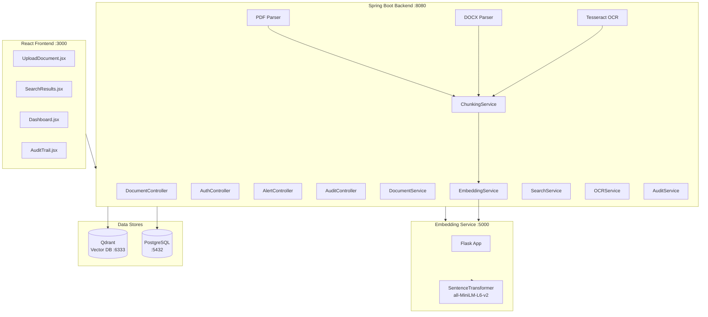
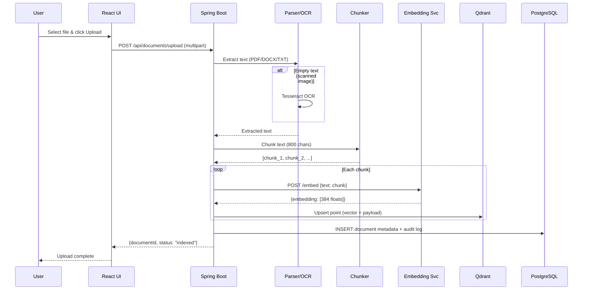
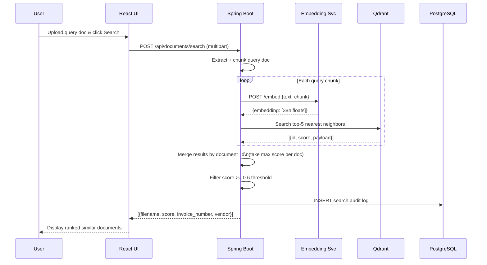

# Technical Requirements Document (TRD)
## AI-Powered Financial Document Similarity Finder

**Version:** 1.0  
**Date:** 2026-05-30  
**Classification:** Internal – Engineering  
**Status:** Draft

---

## Table of Contents

1. [System Architecture Overview](#1-system-architecture-overview)
2. [Tech Stack](#2-tech-stack)
3. [API Design](#3-api-design)
4. [Authentication & Authorization](#4-authentication--authorization)
5. [Third-Party Integrations](#5-third-party-integrations)
6. [Performance Requirements](#6-performance-requirements)
7. [Security Requirements](#7-security-requirements)
8. [Error Handling & Logging](#8-error-handling--logging)
9. [Testing Strategy](#9-testing-strategy)

---

## 1. System Architecture Overview

### 1.1 Architecture Style

The system uses a **microservices-lite** architecture — three independently deployable services (React frontend, Spring Boot backend, Python embedding service) backed by two data stores (Qdrant, PostgreSQL). All services run on-premise via Docker Compose with no cloud dependency.

```
┌─────────────────────────────────────────────────────────────────────┐
│                         LOCAL ON-PREMISE                            │
│                                                                     │
│  ┌──────────────┐     ┌──────────────────────────────────────────┐  │
│  │              │     │         Spring Boot Backend              │  │
│  │  React UI    │────▶│  ┌────────────┐  ┌────────────────────┐ │  │
│  │  :3000       │     │  │ Controllers│  │  Services          │ │  │
│  │              │◀────│  │ /documents │  │  - DocumentService │ │  │
│  └──────────────┘     │  │ /auth      │  │  - EmbedService    │ │  │
│                       │  │ /alerts    │  │  - SearchService   │ │  │
│                       │  └────────────┘  │  - OCRService      │ │  │
│                       │  ┌────────────┐  │  - AuditService    │ │  │
│                       │  │  Parsers   │  └────────────────────┘ │  │
│                       │  │  PDF/DOCX  │                          │  │
│                       │  │  Tesseract │                          │  │
│                       │  └─────┬──────┘                          │  │
│                       └────────┼─────────────────────────────────┘  │
│                                │                                     │
│              ┌─────────────────┼─────────────────┐                  │
│              ▼                 ▼                  ▼                  │
│  ┌───────────────────┐  ┌─────────────┐  ┌──────────────────┐      │
│  │ Python Embedding  │  │   Qdrant    │  │   PostgreSQL     │      │
│  │ Service  :5000    │  │ Vector DB   │  │   :5432          │      │
│  │ (SentenceTransf.) │  │   :6333     │  │   + pgvector     │      │
│  └───────────────────┘  └─────────────┘  └──────────────────┘      │
└─────────────────────────────────────────────────────────────────────┘
```

### 1.2 Component Diagram (Mermaid)



### 1.3 Data Flow — Upload



### 1.4 Data Flow — Search



---

## 2. Tech Stack

### 2.1 Summary Table

| Layer | Technology | Version | Justification |
|---|---|---|---|
| Frontend | React | 18.x | Component model suits upload/search/results UI; large ecosystem; easy Axios integration |
| Backend | Spring Boot | 3.x (Java 21) | Mature REST framework; strong security (Spring Security); integrates with JPA, PDFBox, POI |
| Vector DB | Qdrant | Latest | Free, open-source, local Docker; supports metadata payload filtering; Cosine ANN; REST + gRPC APIs |
| Relational DB | PostgreSQL + pgvector | 15.x | ACID compliance for metadata/audit; pgvector extension for optional SQL-side similarity; pg_dump backups |
| Embedding | Python + Sentence Transformers | 3.10+ / 2.x | `all-MiniLM-L6-v2` — free, 384-dim, fast on CPU (~750 qps), sufficient quality for financial text |
| OCR | Tesseract (via Tess4J) | 4.x | Free, 39-language support; handles scanned invoices; digit whitelist improves financial field accuracy |
| PDF Parsing | Apache PDFBox | 3.x | Mature, battle-tested; extracts text and images from digital PDFs |
| DOCX Parsing | Apache POI | 5.x | Standard Java library for Office formats |
| Containerisation | Docker + Docker Compose | Latest | Reproducible local setup; wraps Qdrant, Postgres, embedding service in one `docker-compose up` |
| HTTP Client | RestTemplate / WebClient | Spring 3.x | Backend-to-embedding-service HTTP calls; WebClient preferred for non-blocking |
| Auth | Spring Security + JWT | — | Stateless JWT fits REST APIs; integrates with RBAC |
| CI/CD | GitHub Actions (optional) | — | Linting, tests, Docker image builds on push |
| Monitoring | Micrometer + Prometheus + Grafana | — | Spring Boot Actuator exports metrics; Prometheus scrapes; Grafana dashboards |
| Logging | SLF4J + Logback (JSON) | — | Structured JSON logs; forward to ELK/Graylog |

### 2.2 Frontend Stack Detail

```
React 18
├── axios             HTTP client for API calls
├── react-dropzone    Drag-and-drop file upload
├── react-router-dom  Page routing (Upload / Search / Dashboard / Audit)
└── tailwindcss       Utility CSS (optional)
```

### 2.3 Backend Package Structure

```
com.fintech.simdocfinder
├── controller/       REST endpoints
├── service/          Business logic (DocumentService, SearchService, AuditService)
├── parser/           PDF, DOCX, plain-text extractors
├── ocr/              Tesseract (Tess4J) wrapper
├── embedding/        HTTP client for Python embedding service
├── vector/           Qdrant client interactions
├── repository/       Spring Data JPA (PostgreSQL)
├── model/            DTOs, JPA entities
├── security/         JWT filter, Spring Security config, RBAC
└── config/           App config, RestTemplate beans
```

---

## 3. API Design

All endpoints are prefixed `/api`. All requests/responses use `application/json` unless noted. File uploads use `multipart/form-data`.

**Base URL (local):** `http://localhost:8080/api`

---

### 3.1 Authentication

#### `POST /auth/login`

Authenticate a user and receive a JWT.

**Auth Required:** None

**Request Body:**
```json
{
  "username": "jsmith",
  "password": "s3cur3!"
}
```

**Response `200 OK`:**
```json
{
  "token": "eyJhbGciOiJIUzI1NiJ9...",
  "expiresIn": 86400,
  "role": "FINANCE_MANAGER"
}
```

**Error Responses:**
- `401 Unauthorized` — invalid credentials
- `400 Bad Request` — missing fields

---

#### `POST /auth/logout`

Invalidate the current JWT (server-side blocklist).

**Auth Required:** Bearer JWT

**Response `200 OK`:**
```json
{ "message": "Logged out successfully" }
```

---

### 3.2 Document Upload

#### `POST /documents/upload`

Upload a financial document for indexing into the vector database.

**Auth Required:** Bearer JWT (`ROLE_CLERK`, `ROLE_FINANCE_MANAGER`, `ROLE_ADMIN`)

**Request:** `multipart/form-data`

| Field | Type | Required | Description |
|---|---|---|---|
| `file` | File | Yes | PDF, DOCX, TXT, PNG, JPG (max 50 MB) |
| `documentType` | String | No | `invoice`, `receipt`, `statement`, `po` |
| `department` | String | No | Owning department tag |

**Response `202 Accepted`:**
```json
{
  "documentId": "doc-a3f9c1b2",
  "filename": "invoice_2048.pdf",
  "status": "INDEXING",
  "chunksGenerated": 4,
  "message": "Document queued for embedding"
}
```

**Error Responses:**
- `400 Bad Request` — unsupported file type or file too large
- `401 Unauthorized` — missing/invalid JWT
- `422 Unprocessable Entity` — text extraction failed and OCR also failed
- `500 Internal Server Error` — embedding service unreachable

---

### 3.3 Document Search

#### `POST /documents/search`

Upload a query document and retrieve the top semantically similar documents.

**Auth Required:** Bearer JWT (all roles)

**Request:** `multipart/form-data`

| Field | Type | Required | Description |
|---|---|---|---|
| `file` | File | Yes | Query document (same types as upload) |
| `topK` | Integer | No | Number of results (default 5, max 20) |
| `threshold` | Float | No | Min similarity score (default 0.6, range 0–1) |
| `vendor` | String | No | Filter by vendor name |
| `dateFrom` | String | No | Filter invoice date from (ISO 8601) |
| `dateTo` | String | No | Filter invoice date to (ISO 8601) |
| `currency` | String | No | Filter by currency code (e.g. `USD`) |

**Response `200 OK`:**
```json
{
  "queryDocumentId": "query-tmp-xyz",
  "results": [
    {
      "documentId": "doc-a3f9c1b2",
      "filename": "invoice_2048.pdf",
      "score": 0.94,
      "similarityLabel": "STRONG_MATCH",
      "vendor": "ABC Supplies",
      "invoiceNumber": "INV-2048",
      "invoiceDate": "2026-03-15",
      "totalAmount": 1250.75,
      "currency": "USD",
      "matchingChunkText": "Total due: USD 1,250.75 payable to ABC Supplies..."
    }
  ],
  "duplicateAlert": false,
  "searchDurationMs": 143
}
```

**Similarity Labels:**

| Score Range | Label |
|---|---|
| >= 0.85 | `STRONG_MATCH` |
| 0.70 – 0.84 | `RELATED` |
| 0.60 – 0.69 | `WEAK_MATCH` |
| < 0.60 | filtered out |

---

### 3.4 Document Management

#### `GET /documents`

List all indexed documents (paginated).

**Auth Required:** Bearer JWT (all roles; clerks see own department only)

**Query Parameters:**

| Param | Type | Default | Description |
|---|---|---|---|
| `page` | int | 0 | Page number |
| `size` | int | 20 | Page size (max 100) |
| `vendor` | string | — | Filter by vendor |
| `documentType` | string | — | Filter by document type |
| `dateFrom` | string | — | ISO 8601 date |
| `dateTo` | string | — | ISO 8601 date |

**Response `200 OK`:**
```json
{
  "content": [
    {
      "documentId": "doc-a3f9c1b2",
      "filename": "invoice_2048.pdf",
      "vendor": "ABC Supplies",
      "invoiceNumber": "INV-2048",
      "invoiceDate": "2026-03-15",
      "totalAmount": 1250.75,
      "currency": "USD",
      "status": "INDEXED",
      "uploadedBy": "jsmith",
      "uploadedAt": "2026-05-29T10:22:00Z"
    }
  ],
  "totalElements": 142,
  "totalPages": 8,
  "page": 0,
  "size": 20
}
```

---

#### `GET /documents/{documentId}`

Retrieve metadata for a single document.

**Auth Required:** Bearer JWT (role-filtered)

**Response `200 OK`:**
```json
{
  "documentId": "doc-a3f9c1b2",
  "filename": "invoice_2048.pdf",
  "documentType": "invoice",
  "vendor": "ABC Supplies",
  "invoiceNumber": "INV-2048",
  "invoiceDate": "2026-03-15",
  "totalAmount": 1250.75,
  "currency": "USD",
  "account": "4001",
  "department": "procurement",
  "status": "INDEXED",
  "ocrUsed": false,
  "chunksCount": 4,
  "uploadedBy": "jsmith",
  "uploadedAt": "2026-05-29T10:22:00Z",
  "retentionExpiresAt": "2033-05-29"
}
```

**Error Responses:**
- `404 Not Found` — document not found
- `403 Forbidden` — insufficient role

---

#### `DELETE /documents/{documentId}`

Delete a document and purge its vectors from Qdrant (GDPR erasure).

**Auth Required:** Bearer JWT (`ROLE_ADMIN` only)

**Response `200 OK`:**
```json
{
  "documentId": "doc-a3f9c1b2",
  "message": "Document deleted and vectors purged"
}
```

---

#### `POST /documents/compare`

Compare two documents directly and return a similarity score.

**Auth Required:** Bearer JWT (all roles)

**Request Body:**
```json
{
  "documentIdA": "doc-a3f9c1b2",
  "documentIdB": "doc-d7e2a4f1"
}
```

**Response `200 OK`:**
```json
{
  "documentIdA": "doc-a3f9c1b2",
  "documentIdB": "doc-d7e2a4f1",
  "score": 0.91,
  "similarityLabel": "STRONG_MATCH",
  "isDuplicateCandidate": true
}
```

---

### 3.5 Alerts

#### `GET /alerts`

Retrieve active fraud/duplicate alerts.

**Auth Required:** Bearer JWT (`ROLE_FINANCE_MANAGER`, `ROLE_ADMIN`)

**Response `200 OK`:**
```json
{
  "alerts": [
    {
      "alertId": "alert-001",
      "type": "DUPLICATE_INVOICE",
      "severity": "HIGH",
      "documentIds": ["doc-a3f9c1b2", "doc-d7e2a4f1"],
      "message": "Two invoices from ABC Supplies for USD 1,250.75 are near-identical",
      "createdAt": "2026-05-29T11:00:00Z",
      "status": "OPEN"
    }
  ]
}
```

---

#### `PATCH /alerts/{alertId}`

Acknowledge or dismiss an alert.

**Auth Required:** Bearer JWT (`ROLE_FINANCE_MANAGER`, `ROLE_ADMIN`)

**Request Body:**
```json
{
  "status": "ACKNOWLEDGED",
  "comment": "Verified with AP team — legitimate re-submission"
}
```

**Response `200 OK`:**
```json
{ "alertId": "alert-001", "status": "ACKNOWLEDGED" }
```

---

### 3.6 Audit Trail

#### `GET /audit`

Retrieve audit log entries.

**Auth Required:** Bearer JWT (`ROLE_ADMIN` only)

**Query Parameters:** `userId`, `action`, `dateFrom`, `dateTo`, `page`, `size`

**Response `200 OK`:**
```json
{
  "content": [
    {
      "auditId": "aud-0091",
      "userId": "jsmith",
      "action": "DOCUMENT_UPLOAD",
      "documentId": "doc-a3f9c1b2",
      "ipAddress": "192.168.1.42",
      "timestamp": "2026-05-29T10:22:00Z",
      "outcome": "SUCCESS"
    }
  ],
  "totalElements": 3840
}
```

---

### 3.7 Health

#### `GET /health`

Application health check (unauthenticated — internal use only, block at network layer).

**Response `200 OK`:**
```json
{
  "status": "UP",
  "components": {
    "qdrant": "UP",
    "postgres": "UP",
    "embeddingService": "UP"
  }
}
```

---

### 3.8 Embedding Service (Internal)

> This service is **internal only** — not exposed to the internet. Called exclusively by Spring Boot.

#### `POST /embed`

**Service:** Python Flask `:5000`

**Request Body:**
```json
{ "text": "Invoice from ABC Supplies, total USD 1,250.75" }
```

**Response `200 OK`:**
```json
{ "embedding": [0.023, -0.118, 0.204, "...383 more floats..."] }
```

#### `POST /embed-batch`

**Request Body:**
```json
{ "texts": ["chunk one", "chunk two", "chunk three"] }
```

**Response `200 OK`:**
```json
{
  "embeddings": [
    [0.023, -0.118, "..."],
    [0.041, 0.033, "..."],
    [-0.012, 0.187, "..."]
  ]
}
```

---

## 4. Authentication & Authorization

### 4.1 Auth Strategy

**JWT (JSON Web Token)** — stateless bearer token auth.

- Tokens issued at `/api/auth/login`, signed with HS256 (configurable to RS256 for production).
- Token lifetime: **24 hours** (configurable).
- A server-side **token blocklist** (Redis or in-memory set) handles logout/revocation.
- All protected endpoints require `Authorization: Bearer <token>` header.
- Spring Security `JwtAuthenticationFilter` validates signature and expiry on every request.

```
Client → POST /auth/login → Spring Security
                           → validate credentials (UserDetailsService → PostgreSQL)
                           → issue JWT (userId, role, expiry)
Client → GET /documents   → JwtAuthenticationFilter
                           → decode + validate JWT
                           → set SecurityContext
                           → dispatch to controller
```

### 4.2 Roles

| Role | Description |
|---|---|
| `ROLE_CLERK` | Upload documents, run searches, view own department's documents |
| `ROLE_FINANCE_MANAGER` | All clerk permissions + view all departments, view/manage alerts |
| `ROLE_ADMIN` | All permissions + delete documents, view audit logs, manage users |

### 4.3 Permission Matrix

| Endpoint | CLERK | FINANCE_MANAGER | ADMIN |
|---|---|---|---|
| `POST /auth/login` | ✅ | ✅ | ✅ |
| `POST /documents/upload` | ✅ | ✅ | ✅ |
| `POST /documents/search` | ✅ | ✅ | ✅ |
| `GET /documents` | Own dept | All | All |
| `GET /documents/{id}` | Own dept | All | All |
| `DELETE /documents/{id}` | ❌ | ❌ | ✅ |
| `POST /documents/compare` | ✅ | ✅ | ✅ |
| `GET /alerts` | ❌ | ✅ | ✅ |
| `PATCH /alerts/{id}` | ❌ | ✅ | ✅ |
| `GET /audit` | ❌ | ❌ | ✅ |
| `GET /health` | Network-level restriction | | |

### 4.4 JWT Payload Structure

```json
{
  "sub": "jsmith",
  "userId": "usr-0042",
  "role": "ROLE_FINANCE_MANAGER",
  "department": "procurement",
  "iat": 1748563200,
  "exp": 1748649600
}
```

---

## 5. Third-Party Integrations

### 5.1 Qdrant Vector Database

| Attribute | Detail |
|---|---|
| Purpose | Store and query 384-dimensional document chunk embeddings |
| Integration Pattern | HTTP REST (JSON) via Spring Boot `RestTemplate` / Qdrant Java client |
| Endpoint | `http://localhost:6333` |
| Collection | `financial_documents` |
| Vector size | 384 (Cosine similarity) |
| Key Operations | `PUT /collections` (init), `POST /points` (upsert), `POST /points/search` (ANN query), `DELETE /points` (erasure), `POST /snapshots` (backup) |
| Payload Filtering | Filter by `vendor`, `invoice_date`, `currency`, `document_type` at query time |

**Collection Config:**
```json
{
  "vectors": {
    "size": 384,
    "distance": "Cosine"
  },
  "on_disk_payload": true
}
```

---

### 5.2 Python Sentence Transformers Embedding Service

| Attribute | Detail |
|---|---|
| Purpose | Convert text chunks into 384-dim semantic vectors |
| Model | `sentence-transformers/all-MiniLM-L6-v2` |
| Integration Pattern | Internal HTTP REST (JSON); Spring Boot calls Flask service |
| Endpoint | `http://localhost:5000` |
| Latency | ~1 ms per chunk on CPU |
| Startup | Model loaded once at Flask startup; held in memory |
| Scaling | Single instance for local; GPU or multi-worker for production |

---

### 5.3 Tesseract OCR (via Tess4J)

| Attribute | Detail |
|---|---|
| Purpose | Extract text from scanned invoices and image-based PDFs |
| Integration Pattern | In-process Java library (Tess4J JNI bindings) |
| Trigger | Only when PDFBox/POI return empty text |
| Language | Default English; multilingual via tessdata language packs |
| Preprocessing | Binarize, deskew images via BufferedImage before OCR |
| Post-processing | Digit/character whitelist for invoice fields (`0-9`, `,.`, currency symbols) |

---

### 5.4 Apache PDFBox

| Attribute | Detail |
|---|---|
| Purpose | Extract digital text from PDF files |
| Integration Pattern | In-process Java library |
| Key Class | `PDFTextStripper` |
| Fallback | If result is blank, hand off to Tesseract OCR |

---

### 5.5 Apache POI

| Attribute | Detail |
|---|---|
| Purpose | Extract text from `.docx` and `.xlsx` files |
| Integration Pattern | In-process Java library |
| Key Classes | `XWPFDocument`, `XWPFWordExtractor` |

---

### 5.6 PostgreSQL + pgvector

| Attribute | Detail |
|---|---|
| Purpose | Persistent metadata store, audit logs, user management, document status |
| Integration Pattern | Spring Data JPA (Hibernate), connection pool via HikariCP |
| pgvector | Optional doc-level embedding column for SQL-side similarity queries |
| Backup | `pg_dump` nightly; WAL archiving for point-in-time recovery |

---

## 6. Performance Requirements

### 6.1 SLA Targets

| Operation | Target P95 Latency | Notes |
|---|---|---|
| Document upload (< 1 MB, digital PDF) | < 3 seconds | Includes parse, chunk, embed, upsert |
| Document upload (scanned image, OCR) | < 10 seconds | OCR adds 5–8 s per page |
| Similarity search (top-5) | < 500 ms | Qdrant ANN search is < 50 ms; bottleneck is embedding |
| Document list (`GET /documents`) | < 200 ms | PostgreSQL paginated query |
| Embedding service (per chunk) | < 50 ms | CPU inference, all-MiniLM-L6-v2 |
| System availability | 99.5% | Local on-premise; scheduled maintenance windows permitted |

### 6.2 Load Expectations

| Metric | Target |
|---|---|
| Concurrent users | 10–50 (finance team) |
| Documents in vector store | Up to 500,000 vectors (Qdrant handles millions) |
| Daily uploads | ~200–500 documents |
| Daily searches | ~100–300 queries |
| Peak throughput | 5 uploads/minute, 10 searches/minute |

### 6.3 Caching Strategy

| Layer | What is Cached | Mechanism | TTL |
|---|---|---|---|
| Embedding Service | Model in memory at startup | Python in-process | Process lifetime |
| Spring Boot | Frequently searched doc embeddings | Spring Cache (Caffeine) | 30 minutes |
| Spring Boot | Document metadata (GET /documents/{id}) | Spring Cache | 5 minutes; evict on update/delete |
| PostgreSQL | Connection pool | HikariCP (pool size 10–20) | Persistent |
| Qdrant | Vector index | HNSW in-memory by default | Process lifetime |

### 6.4 Chunking Strategy

- Chunk size: **800 characters** (~150–200 words)
- Overlap: **0** (non-overlapping for financial docs where field positions are stable)
- Max chunks per document: **50** (documents > 40,000 chars are split to first 50 chunks for search; full doc indexed for completeness)

---

## 7. Security Requirements

### 7.1 Data Encryption

| Layer | Mechanism |
|---|---|
| Data in transit | TLS 1.2+ for all API endpoints (Nginx reverse proxy with self-signed cert locally; CA-signed in production) |
| Data at rest | LUKS full-disk encryption on the host OS volumes holding Qdrant snapshots and PostgreSQL data |
| Sensitive DB fields | AES-256 encryption at application layer for fields: `bank_account`, `tax_id`, `ssn` (if present) |
| Backups | Encrypted archives (`gpg --symmetric`) before transfer to backup storage |

### 7.2 Input Validation

| Check | Implementation |
|---|---|
| File type | MIME type sniffing (Apache Tika) — reject non-PDF/DOCX/TXT/image types |
| File size | Hard limit: **50 MB** per upload (Spring Boot `max-file-size`) |
| File content | Antivirus scan hook (ClamAV integration point; configurable) |
| API input | Bean Validation (`@NotNull`, `@Size`, `@Pattern`) on all DTOs |
| SQL injection | Parameterised queries via JPA/Hibernate — no raw SQL concatenation |
| XSS | React escapes output by default; backend strips HTML from text fields |
| Path traversal | Filenames sanitised; files stored by UUID, not original filename |

### 7.3 Rate Limiting

| Endpoint | Limit |
|---|---|
| `POST /auth/login` | 5 requests/minute per IP |
| `POST /documents/upload` | 20 uploads/minute per user |
| `POST /documents/search` | 30 searches/minute per user |
| All other endpoints | 100 requests/minute per user |

Implementation: Spring Boot filter backed by in-memory `ConcurrentHashMap` sliding window (or Bucket4j for production).

### 7.4 OWASP Top 10 Controls

| OWASP Risk | Control |
|---|---|
| A01 Broken Access Control | RBAC enforced in Spring Security; department-level row filtering in service layer |
| A02 Cryptographic Failures | TLS in transit; AES-256 at rest; no MD5/SHA-1 |
| A03 Injection | Parameterised JPA queries; Qdrant payload filtering (no user-controlled query strings) |
| A04 Insecure Design | Threat modelling documented; least-privilege service accounts |
| A05 Security Misconfiguration | Docker images pinned to digests; Qdrant/Postgres not exposed to internet |
| A06 Vulnerable Components | Dependabot / OWASP Dependency-Check in CI |
| A07 Auth Failures | JWT expiry; rate-limited login; token blocklist on logout |
| A08 Software Integrity | Docker image signing; Git commit signing |
| A09 Logging Failures | Audit log every auth event, upload, search, delete (see Section 8) |
| A10 SSRF | Embedding service URL is static config — no user-controlled URLs fetched |

### 7.5 PII & Compliance

- **PII fields** (vendor bank details, SSN, personal names) are encrypted at the application layer before storage.
- UI **masks** sensitive fields (e.g., shows last 4 digits of account numbers).
- **Right to Erasure (GDPR):** `DELETE /documents/{id}` purges both PostgreSQL record and Qdrant vectors.
- **Data Retention:** Configurable per document type (default 7 years for invoices). A scheduled job flags and deletes expired documents.
- **Audit immutability:** Audit log rows are append-only; no `UPDATE`/`DELETE` permitted on `audit_logs` table.

---

## 8. Error Handling & Logging

### 8.1 Error Taxonomy

| Category | HTTP Status | Error Code | Example |
|---|---|---|---|
| Validation | 400 | `VALIDATION_ERROR` | Missing required field |
| Authentication | 401 | `AUTH_FAILED` | Invalid or expired JWT |
| Authorisation | 403 | `ACCESS_DENIED` | Role insufficient |
| Not Found | 404 | `RESOURCE_NOT_FOUND` | Document ID does not exist |
| Unprocessable | 422 | `EXTRACTION_FAILED` | PDF text empty, OCR failed |
| Rate Limited | 429 | `RATE_LIMIT_EXCEEDED` | Too many requests |
| Dependency Error | 502 | `UPSTREAM_ERROR` | Embedding service down |
| Internal | 500 | `INTERNAL_ERROR` | Unexpected runtime error |

**Standard Error Response Shape:**
```json
{
  "timestamp": "2026-05-29T10:22:00Z",
  "status": 422,
  "errorCode": "EXTRACTION_FAILED",
  "message": "Could not extract text from uploaded file. File may be corrupted.",
  "path": "/api/documents/upload",
  "requestId": "req-abc123"
}
```

All errors are handled by a global `@RestControllerAdvice` — no stack traces exposed to clients.

### 8.2 Logging Strategy

**Format:** Structured JSON (Logback + `logstash-logback-encoder`)

**Log Levels:**

| Level | Usage |
|---|---|
| `ERROR` | Unhandled exceptions, embedding service unreachable, DB failures |
| `WARN` | OCR fallback triggered, similarity below threshold, rate limit approach |
| `INFO` | Document uploaded, search executed, user login/logout |
| `DEBUG` | Chunk content, vector dimensions, Qdrant query params (dev only) |

**Required Fields on Every Log Entry:**

```json
{
  "timestamp": "2026-05-29T10:22:00.123Z",
  "level": "INFO",
  "service": "spring-boot-backend",
  "requestId": "req-abc123",
  "userId": "jsmith",
  "action": "DOCUMENT_UPLOAD",
  "documentId": "doc-a3f9c1b2",
  "durationMs": 2341,
  "outcome": "SUCCESS",
  "message": "Document indexed successfully"
}
```

**Audit Log Events (persisted to PostgreSQL `audit_logs`):**

| Event | Trigger |
|---|---|
| `LOGIN` | Successful authentication |
| `LOGIN_FAILED` | Failed authentication attempt |
| `LOGOUT` | Token invalidated |
| `DOCUMENT_UPLOAD` | File indexed into Qdrant |
| `DOCUMENT_SEARCH` | Similarity search executed |
| `DOCUMENT_DELETE` | Document purged |
| `ALERT_ACKNOWLEDGED` | Finance manager dismisses alert |

### 8.3 Alerting

| Trigger | Alert Channel | Severity |
|---|---|---|
| Embedding service returns 5xx for > 3 consecutive calls | Application log + Prometheus alert | CRITICAL |
| Qdrant unreachable (health check fails) | Application log + Prometheus alert | CRITICAL |
| PostgreSQL connection pool exhausted | Prometheus alert | HIGH |
| OCR failure rate > 20% in a 5-minute window | Prometheus alert | MEDIUM |
| Login failure rate > 10/minute from single IP | Log + optional webhook | HIGH |
| Document retention expiry approaching (30 days) | Email / internal notification | LOW |

Prometheus alertmanager routes alerts to email or webhook (configurable in `alertmanager.yml`).

---

## 9. Testing Strategy

### 9.1 Unit Tests

**Framework:** JUnit 5 + Mockito (Java), pytest (Python)

**Coverage Target:** >= 80% line coverage on service and parser layers.

| Component | Test Focus | Mocks |
|---|---|---|
| `DocumentService` | Upload flow, chunking logic, metadata extraction | Mock `EmbeddingClient`, `QdrantClient`, `DocumentRepository` |
| `SearchService` | Result merging, threshold filtering, dedup logic | Mock `QdrantClient`, `EmbeddingClient` |
| `ParserService` | PDF text extraction, DOCX extraction, OCR trigger condition | Mock `MultipartFile` with sample byte arrays |
| `OCRService` | Tesseract call, image preprocessing | Mock Tess4J `ITesseract` |
| `JwtFilter` | Token validation, expiry, role extraction | — |
| `ChunkingService` | Boundary conditions, empty text, very long text | — |
| `embed_service.py` | `/embed` returns 384-d list, `/embed-batch` returns list of lists | Mock `SentenceTransformer.encode` |

**Sample Unit Test (Java):**
```java
@Test
void chunkText_shouldProduceCorrectNumberOfChunks() {
    String text = "a".repeat(2400); // 3 chunks of 800
    List<String> chunks = chunkingService.chunkText(text);
    assertEquals(3, chunks.size());
    assertEquals(800, chunks.get(0).length());
}

@Test
void searchService_shouldFilterBelowThreshold() {
    // Arrange: mock Qdrant returns scores [0.92, 0.55, 0.78]
    // Act: call findSimilar with threshold 0.6
    // Assert: only 2 results returned (0.55 filtered out)
}
```

---

### 9.2 Integration Tests

**Framework:** Spring Boot Test (`@SpringBootTest`), Testcontainers (Qdrant, PostgreSQL), WireMock (embedding service)

| Test Scenario | Approach |
|---|---|
| Full upload flow | Real Qdrant (Testcontainer) + WireMock for embed service; assert vector count in collection increases |
| Full search flow | Upload known doc, search same doc, assert top result score >= 0.95 |
| OCR fallback | Upload a blank-text PDF; assert Tesseract is invoked |
| Auth + RBAC | Call `DELETE /documents/{id}` with `ROLE_CLERK` JWT; assert 403 |
| Duplicate detection | Upload identical doc twice; assert `duplicateAlert: true` in search response |
| Metadata filtering | Upload docs with two vendors; search with vendor filter; assert only filtered vendor returned |
| Rate limiting | Exceed login rate limit; assert 429 returned |

**Testcontainers Setup:**
```java
@Container
static QdrantContainer qdrant = new QdrantContainer("qdrant/qdrant:latest");

@Container
static PostgreSQLContainer<?> postgres = new PostgreSQLContainer<>("postgres:15-alpine")
    .withInitScript("schema.sql");
```

---

### 9.3 End-to-End (E2E) Tests

**Framework:** Playwright or Cypress (JavaScript)

**Scope:** Full browser-to-backend flows against a locally running Docker Compose stack.

| E2E Test | Steps |
|---|---|
| Upload and search happy path | Login → Upload invoice PDF → Search with same PDF → Assert filename in top result |
| Scanned invoice OCR | Upload image-based PDF → Assert `ocrUsed: true` in document detail |
| Role access | Login as clerk → Navigate to audit page → Assert redirect/403 |
| Duplicate alert | Upload invoice twice → Navigate to alerts → Assert DUPLICATE_INVOICE alert visible |
| Large file rejection | Attempt to upload 60 MB file → Assert error message shown |

---

### 9.4 Performance / Load Tests

**Framework:** k6 or Apache JMeter

**Test Scenarios:**

| Scenario | Config | Pass Criteria |
|---|---|---|
| Upload throughput | 5 virtual users, 60 seconds, each uploading a 500 KB PDF | P95 < 3 s, 0% error rate |
| Search throughput | 10 virtual users, 60 seconds, each searching | P95 < 500 ms, 0% error rate |
| Concurrent mix | 20 VUs mixed (80% search, 20% upload) for 5 min | P95 search < 700 ms, P95 upload < 5 s |
| 10k document scale | Pre-seed 10,000 vectors; run 50 concurrent searches | P95 search < 1 s |

**k6 Script Snippet:**
```javascript
import http from 'k6/http';
import { check } from 'k6';

export let options = { vus: 10, duration: '60s' };

export default function () {
  const res = http.post('http://localhost:8080/api/documents/search',
    open('test_invoice.pdf', 'b'),
    { headers: { 'Authorization': `Bearer ${__ENV.JWT}` } }
  );
  check(res, { 'status 200': (r) => r.status === 200 });
}
```

---

### 9.5 Security Tests

| Test | Tool | Frequency |
|---|---|---|
| Dependency vulnerability scan | OWASP Dependency-Check / Dependabot | Every CI build |
| SAST (static analysis) | SpotBugs + find-sec-bugs (Java), Bandit (Python) | Every CI build |
| Auth bypass attempts | Manual + OWASP ZAP | Pre-release |
| SQL injection probes | OWASP ZAP active scan | Pre-release |
| File upload bypass (MIME spoofing) | Manual test with renamed executables | Pre-release |
| Rate limit enforcement | k6 script exceeding limits | Pre-release |

---

### 9.6 CI/CD Pipeline (GitHub Actions)

```yaml
# .github/workflows/ci.yml
on: [push, pull_request]
jobs:
  backend:
    runs-on: ubuntu-latest
    steps:
      - uses: actions/checkout@v4
      - uses: actions/setup-java@v4
        with: { java-version: '21' }
      - run: mvn test                          # Unit tests
      - run: mvn verify -P integration-tests   # Integration tests (Testcontainers)
      - run: mvn dependency-check:check        # OWASP scan

  embedding-service:
    runs-on: ubuntu-latest
    steps:
      - run: pip install -r requirements.txt
      - run: pytest tests/ -v

  frontend:
    runs-on: ubuntu-latest
    steps:
      - run: npm ci
      - run: npm test -- --watchAll=false      # React unit tests (Jest)
      - run: npm run build                     # Build check
```

---

## Appendix A — PostgreSQL Schema

```sql
CREATE EXTENSION IF NOT EXISTS vector;

CREATE TABLE users (
  id          UUID PRIMARY KEY DEFAULT gen_random_uuid(),
  username    TEXT UNIQUE NOT NULL,
  password    TEXT NOT NULL,         -- bcrypt hash
  role        TEXT NOT NULL,         -- ROLE_CLERK | ROLE_FINANCE_MANAGER | ROLE_ADMIN
  department  TEXT,
  active      BOOLEAN DEFAULT TRUE,
  created_at  TIMESTAMPTZ DEFAULT NOW()
);

CREATE TABLE documents (
  id               UUID PRIMARY KEY DEFAULT gen_random_uuid(),
  filename         TEXT NOT NULL,
  document_type    TEXT,                        -- invoice | receipt | statement | po
  vendor           TEXT,
  invoice_number   TEXT UNIQUE,
  invoice_date     DATE,
  total_amount     NUMERIC(15,2),
  currency         CHAR(3),
  account          TEXT,
  department       TEXT,
  file_path        TEXT,
  status           TEXT DEFAULT 'INDEXING',     -- INDEXING | INDEXED | FAILED | DELETED
  ocr_used         BOOLEAN DEFAULT FALSE,
  chunks_count     INT,
  uploaded_by      UUID REFERENCES users(id),
  uploaded_at      TIMESTAMPTZ DEFAULT NOW(),
  retention_expires DATE,
  embedding        VECTOR(384)                  -- optional doc-level embedding
);

CREATE TABLE audit_logs (
  id          UUID PRIMARY KEY DEFAULT gen_random_uuid(),
  user_id     UUID REFERENCES users(id),
  action      TEXT NOT NULL,
  document_id UUID,
  ip_address  INET,
  outcome     TEXT,                            -- SUCCESS | FAILURE
  detail      JSONB,
  created_at  TIMESTAMPTZ DEFAULT NOW()
);

-- Audit log is append-only; revoke UPDATE/DELETE from app user
REVOKE UPDATE, DELETE ON audit_logs FROM app_user;

CREATE TABLE alerts (
  id           UUID PRIMARY KEY DEFAULT gen_random_uuid(),
  alert_type   TEXT NOT NULL,                  -- DUPLICATE_INVOICE | FRAUD_SUSPECT | ANOMALY
  severity     TEXT NOT NULL,                  -- HIGH | MEDIUM | LOW
  document_ids UUID[],
  message      TEXT,
  status       TEXT DEFAULT 'OPEN',            -- OPEN | ACKNOWLEDGED | DISMISSED
  created_at   TIMESTAMPTZ DEFAULT NOW()
);
```

---

## Appendix B — Qdrant Point Payload Schema

```json
{
  "document_id":    "doc-a3f9c1b2",
  "filename":       "invoice_2048.pdf",
  "document_type":  "invoice",
  "chunk_index":    0,
  "chunk_text":     "Invoice from ABC Supplies dated 2026-03-15...",
  "vendor":         "ABC Supplies",
  "invoice_number": "INV-2048",
  "invoice_date":   "2026-03-15",
  "total_amount":   1250.75,
  "currency":       "USD",
  "account":        "4001",
  "department":     "procurement",
  "uploaded_by":    "usr-0042",
  "uploaded_at":    "2026-05-29T10:22:00Z"
}
```

---

*End of Technical Requirements Document*
