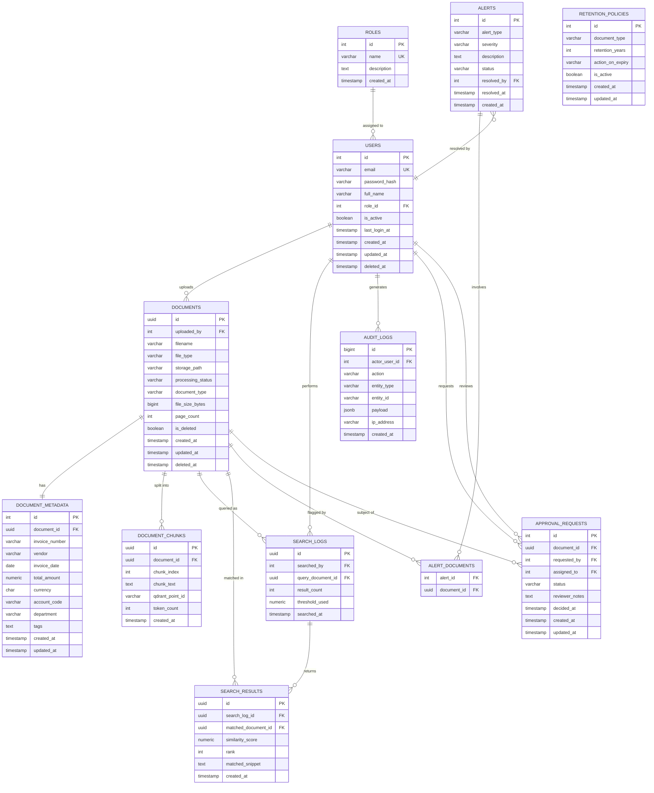

# Backend Schema Document
## AI-Powered Financial Document Similarity Finder

---

## 1. Entity Relationship Overview

### Plain-English Description

The system revolves around **Users** who belong to **Roles** (e.g. Finance Clerk, Finance Manager, Admin). Each user may upload one or more **Documents** — PDFs, DOCX files, or scanned images. A Document passes through a processing pipeline: text is extracted, split into **Document Chunks**, and each chunk is converted into a vector embedding stored in Qdrant (referenced by a `qdrant_point_id`).

Every Document carries structured **Document Metadata** (invoice number, vendor, amount, currency, date, account) extracted from its text or OCR output. Metadata is stored relationally so it can be filtered, aggregated, and reported on independently of the vector store.

When a user performs a similarity search, a **Search Log** record is created, capturing the query document and the top-K results. Each result is stored as a **Search Result** row linked back to both the search log and the matched document. This gives a full, auditable history of every search session.

**Audit Logs** capture every significant action (upload, search, delete, login, role change) with the acting user, timestamp, and a JSON payload of changed fields — supporting GDPR and financial-compliance audit trails.

**Alerts** are system-generated records flagged during processing (duplicate invoice detected, fraud anomaly, unusual amount) and linked to one or more documents.

**Approval Requests** model a lightweight workflow: a document can be submitted for approval, assigned to a reviewer (another user), and resolved with an approved/rejected status.

**Retention Policies** are tenant-level or global rules that govern how long documents of a given type are kept before auto-deletion.

---

### ER Diagram (Mermaid erDiagram)



---

## 2. Database Tables / Collections

---

### 2.1 `roles`

**Purpose:** Lookup table defining available system roles and their descriptions. Drives RBAC across the application.

```sql
CREATE TABLE roles (
    id          SERIAL          PRIMARY KEY,
    name        VARCHAR(50)     NOT NULL UNIQUE,          -- e.g. 'admin', 'finance_manager'
    description TEXT,
    created_at  TIMESTAMP       NOT NULL DEFAULT NOW()
);

-- Indexes
CREATE UNIQUE INDEX idx_roles_name ON roles(name);
```

---

### 2.2 `users`

**Purpose:** Stores all authenticated users of the system. Each user has exactly one role. Soft-delete via `deleted_at`.

```sql
CREATE TABLE users (
    id              SERIAL          PRIMARY KEY,
    email           VARCHAR(255)    NOT NULL UNIQUE,
    password_hash   VARCHAR(255)    NOT NULL,              -- bcrypt hash
    full_name       VARCHAR(255)    NOT NULL,
    role_id         INT             NOT NULL REFERENCES roles(id),
    is_active       BOOLEAN         NOT NULL DEFAULT TRUE,
    last_login_at   TIMESTAMP,
    created_at      TIMESTAMP       NOT NULL DEFAULT NOW(),
    updated_at      TIMESTAMP       NOT NULL DEFAULT NOW(),
    deleted_at      TIMESTAMP                              -- NULL = active
);

-- Indexes
CREATE UNIQUE INDEX idx_users_email ON users(email);
CREATE INDEX idx_users_role_id    ON users(role_id);
CREATE INDEX idx_users_deleted_at ON users(deleted_at);
```

---

### 2.3 `documents`

**Purpose:** Master record for every financial document uploaded to the system. Tracks processing status, file location, and soft deletion. The actual vector embeddings live in Qdrant, referenced via `document_chunks`.

```sql
CREATE TABLE documents (
    id                  UUID            PRIMARY KEY DEFAULT gen_random_uuid(),
    uploaded_by         INT             NOT NULL REFERENCES users(id),
    filename            VARCHAR(512)    NOT NULL,
    file_type           VARCHAR(20)     NOT NULL,          -- see enum: file_type_enum
    storage_path        VARCHAR(1024)   NOT NULL,          -- on-disk or volume path
    processing_status   VARCHAR(30)     NOT NULL DEFAULT 'pending',  -- see enum
    document_type       VARCHAR(50),                       -- see enum: document_type_enum
    file_size_bytes     BIGINT,
    page_count          INT,
    is_deleted          BOOLEAN         NOT NULL DEFAULT FALSE,
    created_at          TIMESTAMP       NOT NULL DEFAULT NOW(),
    updated_at          TIMESTAMP       NOT NULL DEFAULT NOW(),
    deleted_at          TIMESTAMP
);

-- Indexes
CREATE INDEX idx_documents_uploaded_by       ON documents(uploaded_by);
CREATE INDEX idx_documents_processing_status ON documents(processing_status);
CREATE INDEX idx_documents_document_type     ON documents(document_type);
CREATE INDEX idx_documents_created_at        ON documents(created_at DESC);
CREATE INDEX idx_documents_deleted_at        ON documents(deleted_at);
```

---

### 2.4 `document_metadata`

**Purpose:** Structured financial fields extracted from each document — invoice number, vendor, amount, etc. Enables metadata-filtered vector searches (e.g. "find similar invoices from same vendor in date range").

```sql
CREATE TABLE document_metadata (
    id              SERIAL          PRIMARY KEY,
    document_id     UUID            NOT NULL UNIQUE REFERENCES documents(id) ON DELETE CASCADE,
    invoice_number  VARCHAR(100),
    vendor          VARCHAR(255),
    invoice_date    DATE,
    total_amount    NUMERIC(15, 2)  CHECK (total_amount > 0),
    currency        CHAR(3),                               -- ISO 4217, e.g. 'USD', 'INR'
    account_code    VARCHAR(50),
    department      VARCHAR(100),
    tags            TEXT[],                                -- e.g. ARRAY['utilities','energy']
    created_at      TIMESTAMP       NOT NULL DEFAULT NOW(),
    updated_at      TIMESTAMP       NOT NULL DEFAULT NOW()
);

-- Indexes
CREATE UNIQUE INDEX idx_doc_meta_document_id    ON document_metadata(document_id);
CREATE INDEX        idx_doc_meta_invoice_number ON document_metadata(invoice_number);
CREATE INDEX        idx_doc_meta_vendor         ON document_metadata(vendor);
CREATE INDEX        idx_doc_meta_invoice_date   ON document_metadata(invoice_date);
CREATE INDEX        idx_doc_meta_total_amount   ON document_metadata(total_amount);
CREATE INDEX        idx_doc_meta_currency       ON document_metadata(currency);
```

---

### 2.5 `document_chunks`

**Purpose:** Each document is split into text chunks of ~500–1000 characters before embedding. This table records every chunk and its corresponding Qdrant point ID, allowing results from Qdrant to be traced back to specific documents.

```sql
CREATE TABLE document_chunks (
    id              UUID            PRIMARY KEY DEFAULT gen_random_uuid(),
    document_id     UUID            NOT NULL REFERENCES documents(id) ON DELETE CASCADE,
    chunk_index     INT             NOT NULL,              -- 0-based position in document
    chunk_text      TEXT            NOT NULL,
    qdrant_point_id VARCHAR(128)    NOT NULL UNIQUE,       -- Qdrant internal UUID for this vector
    token_count     INT,
    created_at      TIMESTAMP       NOT NULL DEFAULT NOW(),

    CONSTRAINT uq_chunk_doc_index UNIQUE (document_id, chunk_index)
);

-- Indexes
CREATE INDEX idx_chunks_document_id     ON document_chunks(document_id);
CREATE UNIQUE INDEX idx_chunks_qdrant   ON document_chunks(qdrant_point_id);
```

---

### 2.6 `search_logs`

**Purpose:** Records every similarity search performed, including who searched, which document was the query, and high-level parameters (threshold, result count). The detailed matches are in `search_results`.

```sql
CREATE TABLE search_logs (
    id                  UUID            PRIMARY KEY DEFAULT gen_random_uuid(),
    searched_by         INT             NOT NULL REFERENCES users(id),
    query_document_id   UUID            REFERENCES documents(id) ON DELETE SET NULL,
    result_count        INT             NOT NULL DEFAULT 0,
    threshold_used      NUMERIC(4, 3)   NOT NULL DEFAULT 0.700, -- cosine similarity cutoff
    searched_at         TIMESTAMP       NOT NULL DEFAULT NOW()
);

-- Indexes
CREATE INDEX idx_search_logs_searched_by       ON search_logs(searched_by);
CREATE INDEX idx_search_logs_query_document_id ON search_logs(query_document_id);
CREATE INDEX idx_search_logs_searched_at       ON search_logs(searched_at DESC);
```

---

### 2.7 `search_results`

**Purpose:** Stores each individual matched document returned by a similarity search. Supports re-display of past search sessions and trend analysis on what documents get matched most.

```sql
CREATE TABLE search_results (
    id                  UUID            PRIMARY KEY DEFAULT gen_random_uuid(),
    search_log_id       UUID            NOT NULL REFERENCES search_logs(id) ON DELETE CASCADE,
    matched_document_id UUID            NOT NULL REFERENCES documents(id) ON DELETE CASCADE,
    similarity_score    NUMERIC(6, 5)   NOT NULL CHECK (similarity_score BETWEEN 0 AND 1),
    rank                INT             NOT NULL CHECK (rank >= 1),
    matched_snippet     TEXT,
    created_at          TIMESTAMP       NOT NULL DEFAULT NOW()
);

-- Indexes
CREATE INDEX idx_search_results_search_log_id       ON search_results(search_log_id);
CREATE INDEX idx_search_results_matched_document_id ON search_results(matched_document_id);
CREATE INDEX idx_search_results_similarity_score    ON search_results(similarity_score DESC);
```

---

### 2.8 `audit_logs`

**Purpose:** Immutable append-only log of all security-relevant and business-relevant actions. Supports GDPR compliance, financial auditing, and incident investigation. Never updated or soft-deleted.

```sql
CREATE TABLE audit_logs (
    id              BIGSERIAL       PRIMARY KEY,
    actor_user_id   INT             REFERENCES users(id) ON DELETE SET NULL,
    action          VARCHAR(100)    NOT NULL,  -- e.g. 'DOCUMENT_UPLOAD', 'SEARCH', 'USER_DELETE'
    entity_type     VARCHAR(100),              -- e.g. 'document', 'user', 'alert'
    entity_id       VARCHAR(128),              -- UUID or int as text
    payload         JSONB,                     -- before/after state or search params
    ip_address      INET,
    created_at      TIMESTAMP       NOT NULL DEFAULT NOW()
);

-- Indexes
CREATE INDEX idx_audit_logs_actor_user_id ON audit_logs(actor_user_id);
CREATE INDEX idx_audit_logs_action        ON audit_logs(action);
CREATE INDEX idx_audit_logs_entity        ON audit_logs(entity_type, entity_id);
CREATE INDEX idx_audit_logs_created_at    ON audit_logs(created_at DESC);
```

---

### 2.9 `alerts`

**Purpose:** System-generated alerts for duplicate invoices, fraud anomalies, or unusual amounts. Can be acknowledged and resolved by authorized users.

```sql
CREATE TABLE alerts (
    id              SERIAL          PRIMARY KEY,
    alert_type      VARCHAR(50)     NOT NULL,     -- see enum: alert_type_enum
    severity        VARCHAR(20)     NOT NULL,     -- see enum: severity_enum
    description     TEXT            NOT NULL,
    status          VARCHAR(20)     NOT NULL DEFAULT 'open',  -- see enum: alert_status_enum
    resolved_by     INT             REFERENCES users(id) ON DELETE SET NULL,
    resolved_at     TIMESTAMP,
    created_at      TIMESTAMP       NOT NULL DEFAULT NOW()
);

-- Indexes
CREATE INDEX idx_alerts_alert_type ON alerts(alert_type);
CREATE INDEX idx_alerts_status     ON alerts(status);
CREATE INDEX idx_alerts_severity   ON alerts(severity);
CREATE INDEX idx_alerts_created_at ON alerts(created_at DESC);
```

---

### 2.10 `alert_documents` (Junction Table)

**Purpose:** M:N join table connecting alerts to the one or more documents that triggered them (e.g. a duplicate alert links two invoice documents).

```sql
CREATE TABLE alert_documents (
    alert_id    INT     NOT NULL REFERENCES alerts(id) ON DELETE CASCADE,
    document_id UUID    NOT NULL REFERENCES documents(id) ON DELETE CASCADE,

    PRIMARY KEY (alert_id, document_id)
);

-- Indexes
CREATE INDEX idx_alert_documents_document_id ON alert_documents(document_id);
```

---

### 2.11 `approval_requests`

**Purpose:** Lightweight approval workflow for flagged or high-value documents. A document can be submitted for review and either approved or rejected by an assigned reviewer.

```sql
CREATE TABLE approval_requests (
    id              SERIAL          PRIMARY KEY,
    document_id     UUID            NOT NULL REFERENCES documents(id) ON DELETE CASCADE,
    requested_by    INT             NOT NULL REFERENCES users(id),
    assigned_to     INT             REFERENCES users(id) ON DELETE SET NULL,
    status          VARCHAR(20)     NOT NULL DEFAULT 'pending',  -- see enum: approval_status_enum
    reviewer_notes  TEXT,
    decided_at      TIMESTAMP,
    created_at      TIMESTAMP       NOT NULL DEFAULT NOW(),
    updated_at      TIMESTAMP       NOT NULL DEFAULT NOW()
);

-- Indexes
CREATE INDEX idx_approval_requests_document_id ON approval_requests(document_id);
CREATE INDEX idx_approval_requests_assigned_to ON approval_requests(assigned_to);
CREATE INDEX idx_approval_requests_status      ON approval_requests(status);
```

---

### 2.12 `retention_policies`

**Purpose:** Configurable rules that control how long documents of each type are retained before being auto-archived or purged. Supports regulatory compliance (e.g. 7-year retention for invoices).

```sql
CREATE TABLE retention_policies (
    id                  SERIAL          PRIMARY KEY,
    document_type       VARCHAR(50)     NOT NULL UNIQUE,    -- matches document_type_enum
    retention_years     INT             NOT NULL CHECK (retention_years BETWEEN 1 AND 30),
    action_on_expiry    VARCHAR(20)     NOT NULL DEFAULT 'archive', -- 'archive' | 'delete'
    is_active           BOOLEAN         NOT NULL DEFAULT TRUE,
    created_at          TIMESTAMP       NOT NULL DEFAULT NOW(),
    updated_at          TIMESTAMP       NOT NULL DEFAULT NOW()
);

-- Indexes
CREATE UNIQUE INDEX idx_retention_policies_document_type ON retention_policies(document_type);
```

---

## 3. Enums & Lookup Tables

All controlled vocabulary is implemented as PostgreSQL `CHECK` constraints (or native `ENUM` types at your discretion). Values are documented below.

### 3.1 `file_type_enum`
Allowed values for `documents.file_type`:

| Value     | Description                         |
|-----------|-------------------------------------|
| `pdf`     | PDF document                        |
| `docx`    | Microsoft Word document             |
| `txt`     | Plain text file                     |
| `png`     | PNG image (scanned doc)             |
| `jpg`     | JPEG image (scanned doc)            |
| `tiff`    | TIFF image (high-res scanned doc)   |

---

### 3.2 `processing_status_enum`
Allowed values for `documents.processing_status`:

| Value        | Description                                           |
|--------------|-------------------------------------------------------|
| `pending`    | Uploaded but not yet processed                        |
| `processing` | Text extraction / OCR / chunking / embedding underway |
| `completed`  | All chunks embedded and stored in Qdrant              |
| `failed`     | Processing encountered an unrecoverable error         |
| `archived`   | Retained but removed from active search index         |

---

### 3.3 `document_type_enum`
Allowed values for `documents.document_type` and `retention_policies.document_type`:

| Value              | Description                  |
|--------------------|------------------------------|
| `invoice`          | Supplier invoice              |
| `receipt`          | Payment receipt               |
| `purchase_order`   | Purchase order                |
| `bank_statement`   | Bank account statement        |
| `payment_record`   | Payment confirmation          |
| `expense_claim`    | Employee expense claim        |
| `contract`         | Vendor/client contract        |
| `other`            | Uncategorised document        |

---

### 3.4 `role_name_enum`
Allowed values for `roles.name`:

| Value               | Description                                         |
|---------------------|-----------------------------------------------------|
| `admin`             | Full system access including user management        |
| `finance_manager`   | View all documents, approve/reject, view all alerts |
| `finance_clerk`     | Upload and search within own department             |
| `auditor`           | Read-only access to all documents and audit logs    |
| `viewer`            | Read-only access to approved documents              |

---

### 3.5 `alert_type_enum`
Allowed values for `alerts.alert_type`:

| Value                 | Description                                         |
|-----------------------|-----------------------------------------------------|
| `duplicate_invoice`   | Two documents share invoice number or near-identical content |
| `fraud_anomaly`       | Amount or vendor pattern deviates significantly     |
| `unusual_amount`      | Invoice amount is statistical outlier for vendor    |
| `unknown_vendor`      | Vendor not seen in historical data                  |
| `ocr_low_confidence`  | OCR confidence fell below acceptable threshold      |
| `policy_violation`    | Document violates a retention or compliance rule    |

---

### 3.6 `severity_enum`
Allowed values for `alerts.severity`:

| Value      | Description                          |
|------------|--------------------------------------|
| `critical` | Immediate action required            |
| `high`     | Review within 24 hours               |
| `medium`   | Review within the week               |
| `low`      | Informational only                   |

---

### 3.7 `alert_status_enum`
Allowed values for `alerts.status`:

| Value          | Description                              |
|----------------|------------------------------------------|
| `open`         | Not yet reviewed                         |
| `acknowledged` | Seen and under investigation             |
| `resolved`     | Closed with outcome noted                |
| `false_positive` | Marked as incorrectly flagged          |

---

### 3.8 `approval_status_enum`
Allowed values for `approval_requests.status`:

| Value      | Description                       |
|------------|-----------------------------------|
| `pending`  | Awaiting reviewer decision        |
| `approved` | Reviewer approved the document    |
| `rejected` | Reviewer rejected the document    |
| `cancelled`| Request withdrawn before decision |

---

### 3.9 `action_on_expiry_enum`
Allowed values for `retention_policies.action_on_expiry`:

| Value     | Description                                   |
|-----------|-----------------------------------------------|
| `archive` | Move to cold storage, remove from search index |
| `delete`  | Hard delete document and all vectors           |

---

## 4. Relationships

| # | Parent Table        | Child Table          | FK Column(s)               | Cardinality | Notes                                               |
|---|---------------------|----------------------|----------------------------|-------------|-----------------------------------------------------|
| 1 | `roles`             | `users`              | `users.role_id`            | 1 : N       | One role may apply to many users                    |
| 2 | `users`             | `documents`          | `documents.uploaded_by`    | 1 : N       | A user uploads many documents                       |
| 3 | `documents`         | `document_metadata`  | `document_metadata.document_id` | 1 : 1  | Each document has exactly one metadata record       |
| 4 | `documents`         | `document_chunks`    | `document_chunks.document_id` | 1 : N   | A document is split into many chunks                |
| 5 | `users`             | `search_logs`        | `search_logs.searched_by`  | 1 : N       | A user performs many searches                       |
| 6 | `documents`         | `search_logs`        | `search_logs.query_document_id` | 1 : N  | A document may be used as query multiple times      |
| 7 | `search_logs`       | `search_results`     | `search_results.search_log_id` | 1 : N  | One search yields many result rows                  |
| 8 | `documents`         | `search_results`     | `search_results.matched_document_id` | 1 : N | A document may appear as a match many times  |
| 9 | `users`             | `audit_logs`         | `audit_logs.actor_user_id` | 1 : N       | Every auditable action links back to a user         |
| 10 | `users`            | `alerts` (resolved)  | `alerts.resolved_by`       | 1 : N       | A user may resolve many alerts                      |
| 11 | `alerts`           | `alert_documents`    | `alert_documents.alert_id` | M : N       | An alert may involve multiple documents and vice versa |
| 12 | `documents`        | `alert_documents`    | `alert_documents.document_id` | M : N    | (via junction table)                                |
| 13 | `documents`        | `approval_requests`  | `approval_requests.document_id` | 1 : N  | A document may have multiple approval request cycles |
| 14 | `users`            | `approval_requests` (requester) | `approval_requests.requested_by` | 1 : N | User submits requests  |
| 15 | `users`            | `approval_requests` (reviewer)  | `approval_requests.assigned_to`  | 1 : N | User reviews requests  |

---

## 5. Data Validation Rules

### `users`
- `email` must match a valid email regex and be unique across all non-deleted users.
- `password_hash` is stored as a bcrypt hash (never plaintext); minimum input password length is 8 characters enforced at application layer.
- A user may only be assigned a `role_id` that exists in the `roles` table.
- `deleted_at` is set on soft-delete; the application must filter `WHERE deleted_at IS NULL` for all active-user queries.

### `documents`
- `file_size_bytes` must be > 0 and ≤ 50 MB (enforced at API layer before persisting).
- `file_type` must be one of the values in `file_type_enum`.
- `processing_status` transitions are one-way except for `failed` → `pending` (retry): `pending → processing → completed | failed`.
- `storage_path` must not be empty; must be a valid internal path or volume mount.

### `document_metadata`
- `total_amount` must be > 0 (enforced via `CHECK (total_amount > 0)`).
- `currency` must be a valid ISO 4217 3-letter code (enforced at application layer against a currency list).
- `invoice_number` is not globally unique (same invoice number can exist across different vendors), but the combination `(invoice_number, vendor)` should be flagged as a potential duplicate via the alert system.
- `invoice_date` must not be in the future at time of upload.
- `tags` is a text array; each tag must be ≤ 50 characters; maximum 20 tags per document.

### `document_chunks`
- `chunk_index` must be ≥ 0 and unique per `document_id` (enforced by `UNIQUE (document_id, chunk_index)`).
- `qdrant_point_id` must be globally unique (enforced by `UNIQUE` index) — one Qdrant point per chunk.
- `chunk_text` must not be empty (length ≥ 1 character).

### `search_logs`
- `threshold_used` must be between 0.000 and 1.000.
- `result_count` must be ≥ 0.

### `search_results`
- `similarity_score` must be between 0 and 1 (enforced via `CHECK`).
- `rank` must be ≥ 1.
- A `(search_log_id, matched_document_id)` pair should be unique — a document cannot appear twice in the same search result set.

### `alerts`
- `resolved_at` must be NULL when `status` is `open` or `acknowledged`.
- `resolved_by` must be set when `status` is `resolved` or `false_positive`.
- `severity` and `alert_type` must be from their respective enums.

### `approval_requests`
- `decided_at` must be NULL while `status = 'pending'`; must be set when status transitions to `approved`, `rejected`, or `cancelled`.
- `requested_by` and `assigned_to` must be different users.
- Only one `pending` approval request may exist per document at a time (enforced at application layer).

### `retention_policies`
- `retention_years` must be between 1 and 30.
- `document_type` must be unique — only one policy per document type.

---

## 6. Audit & Soft Delete Strategy

### Soft Delete

All primary entity tables (`users`, `documents`) use a `deleted_at TIMESTAMP` column:

- **Deleted** records have `deleted_at` set to the current UTC timestamp.
- **Active** records have `deleted_at = NULL`.
- All application queries append `WHERE deleted_at IS NULL` (or use a database view).
- Hard deletes are never performed directly on `documents` or `users` — data is first soft-deleted, then purged by the retention policy engine at expiry time.
- `document_chunks` and `document_metadata` are hard-deleted via `ON DELETE CASCADE` when their parent `document` is hard-purged.

### Timestamp Columns

Every table includes the following standard columns:

| Column       | Type        | Default     | Set by        | Notes                                         |
|--------------|-------------|-------------|---------------|-----------------------------------------------|
| `created_at` | TIMESTAMP   | `NOW()`     | Database      | Set once on INSERT, never updated             |
| `updated_at` | TIMESTAMP   | `NOW()`     | Application   | Updated on every UPDATE via trigger or ORM    |
| `deleted_at` | TIMESTAMP   | NULL        | Application   | Set on soft-delete; NULL = active record      |

A trigger function keeps `updated_at` current automatically:

```sql
CREATE OR REPLACE FUNCTION set_updated_at()
RETURNS TRIGGER AS $$
BEGIN
    NEW.updated_at = NOW();
    RETURN NEW;
END;
$$ LANGUAGE plpgsql;

-- Apply to all mutable tables
CREATE TRIGGER trg_users_updated_at
    BEFORE UPDATE ON users
    FOR EACH ROW EXECUTE FUNCTION set_updated_at();

CREATE TRIGGER trg_documents_updated_at
    BEFORE UPDATE ON documents
    FOR EACH ROW EXECUTE FUNCTION set_updated_at();

CREATE TRIGGER trg_document_metadata_updated_at
    BEFORE UPDATE ON document_metadata
    FOR EACH ROW EXECUTE FUNCTION set_updated_at();

CREATE TRIGGER trg_approval_requests_updated_at
    BEFORE UPDATE ON approval_requests
    FOR EACH ROW EXECUTE FUNCTION set_updated_at();

CREATE TRIGGER trg_retention_policies_updated_at
    BEFORE UPDATE ON retention_policies
    FOR EACH ROW EXECUTE FUNCTION set_updated_at();
```

### Audit Log Strategy

- `audit_logs` is **append-only** — no `UPDATE` or `DELETE` is ever issued against it.
- Every INSERT to `audit_logs` is written synchronously within the same transaction as the triggering action (or via an event queue for async actions).
- The `payload` JSONB column stores a `{"before": {...}, "after": {...}}` diff for update actions, and the full object for create/delete actions.
- Minimum retention for audit logs: **7 years** (configurable separately from document retention).
- Sensitive fields (bank account numbers, full SSNs) are **hashed** (`SHA-256`) in the `payload` before storage.

### Created-By Tracking

Rather than a separate `created_by` column on every table, the `uploaded_by` / `requested_by` / `actor_user_id` columns serve this purpose contextually per table. The `audit_logs` table provides the definitive record of who created, modified, or deleted any entity.

---

## 7. Sample Seed Data

### `roles`
```sql
INSERT INTO roles (id, name, description) VALUES
(1, 'admin',           'Full access to all system features including user and role management'),
(2, 'finance_manager', 'Can view all documents, approve or reject workflows, and resolve alerts'),
(3, 'finance_clerk',   'Can upload and search documents within their own department'),
(4, 'auditor',         'Read-only access to documents, search history, and audit logs');
```

---

### `users`
```sql
INSERT INTO users (id, email, password_hash, full_name, role_id, is_active) VALUES
(1, 'admin@finco.internal',   '$2a$12$Kx1aB9z...AdminHashHere',   'System Administrator', 1, TRUE),
(2, 'priya.sharma@finco.com', '$2a$12$Lm2bC8y...ManagerHashHere', 'Priya Sharma',         2, TRUE),
(3, 'raj.mehta@finco.com',    '$2a$12$Mn3dD7x...ClerkHashHere',   'Raj Mehta',            3, TRUE);
```

---

### `documents`
```sql
INSERT INTO documents (id, uploaded_by, filename, file_type, storage_path, processing_status, document_type, file_size_bytes, page_count) VALUES
('a1b2c3d4-0001-0000-0000-000000000001', 3, 'invoice_acme_may2026.pdf',   'pdf',  '/data/docs/2026/05/invoice_acme_may2026.pdf',   'completed', 'invoice',        245120, 2),
('a1b2c3d4-0002-0000-0000-000000000002', 3, 'receipt_globex_apr2026.pdf', 'pdf',  '/data/docs/2026/04/receipt_globex_apr2026.pdf', 'completed', 'receipt',        102400, 1),
('a1b2c3d4-0003-0000-0000-000000000003', 2, 'bank_stmt_q1_2026.pdf',      'pdf',  '/data/docs/2026/q1/bank_stmt_q1_2026.pdf',      'processing','bank_statement', 819200, 12);
```

---

### `document_metadata`
```sql
INSERT INTO document_metadata (document_id, invoice_number, vendor, invoice_date, total_amount, currency, account_code, department, tags) VALUES
('a1b2c3d4-0001-0000-0000-000000000001', 'INV-2026-00412', 'Acme Corp',    '2026-05-15', 12500.00, 'USD', '4001', 'Operations', ARRAY['utilities','electricity']),
('a1b2c3d4-0002-0000-0000-000000000002', 'REC-APR-0089',   'Globex Ltd',   '2026-04-30',  3750.50, 'USD', '5002', 'IT',         ARRAY['software','saas']),
('a1b2c3d4-0003-0000-0000-000000000003', NULL,              'HDFC Bank',    '2026-03-31', NULL,     'INR', '1001', 'Finance',    ARRAY['banking','statement']);
```

---

### `document_chunks`
```sql
INSERT INTO document_chunks (id, document_id, chunk_index, chunk_text, qdrant_point_id, token_count) VALUES
(gen_random_uuid(), 'a1b2c3d4-0001-0000-0000-000000000001', 0, 'INVOICE Acme Corp | Date: 2026-05-15 | Invoice No: INV-2026-00412 | Bill To: FinCo Inc...', 'qdrant-pt-0001-chunk-0', 142),
(gen_random_uuid(), 'a1b2c3d4-0001-0000-0000-000000000001', 1, 'Line Items: Electricity supply May 2026 - 12500.00 USD. Payment due within 30 days. Bank: ...', 'qdrant-pt-0001-chunk-1', 138),
(gen_random_uuid(), 'a1b2c3d4-0002-0000-0000-000000000002', 0, 'RECEIPT Globex Ltd | Receipt No: REC-APR-0089 | Date: 2026-04-30 | Amount Paid: 3750.50 USD...', 'qdrant-pt-0002-chunk-0', 120);
```

---

### `search_logs` & `search_results`
```sql
INSERT INTO search_logs (id, searched_by, query_document_id, result_count, threshold_used) VALUES
('b9e1f2a3-0001-0000-0000-000000000001', 3, 'a1b2c3d4-0001-0000-0000-000000000001', 2, 0.700);

INSERT INTO search_results (id, search_log_id, matched_document_id, similarity_score, rank, matched_snippet) VALUES
(gen_random_uuid(), 'b9e1f2a3-0001-0000-0000-000000000001', 'a1b2c3d4-0002-0000-0000-000000000002', 0.87342, 1, 'RECEIPT Globex Ltd | Amount Paid: 3750.50 USD...'),
(gen_random_uuid(), 'b9e1f2a3-0001-0000-0000-000000000001', 'a1b2c3d4-0003-0000-0000-000000000003', 0.71204, 2, 'HDFC Bank Statement Q1 2026...');
```

---

### `alerts`
```sql
INSERT INTO alerts (id, alert_type, severity, description, status) VALUES
(1, 'duplicate_invoice', 'high',   'Invoice INV-2026-00412 from Acme Corp appears to match a previously uploaded document with similarity score 0.97.', 'open'),
(2, 'unusual_amount',    'medium', 'Invoice from Globex Ltd is 340% higher than the 6-month average for this vendor.', 'acknowledged'),
(3, 'unknown_vendor',    'low',    'Document uploaded with vendor name "Zenith Supplies" — no prior history found in system.', 'resolved');
```

---

### `retention_policies`
```sql
INSERT INTO retention_policies (document_type, retention_years, action_on_expiry, is_active) VALUES
('invoice',        7,  'archive', TRUE),
('receipt',        5,  'archive', TRUE),
('bank_statement', 7,  'archive', TRUE),
('purchase_order', 7,  'delete',  TRUE),
('expense_claim',  5,  'delete',  TRUE),
('contract',       10, 'archive', TRUE),
('other',          3,  'delete',  TRUE);
```

---

*End of Backend Schema Document*
